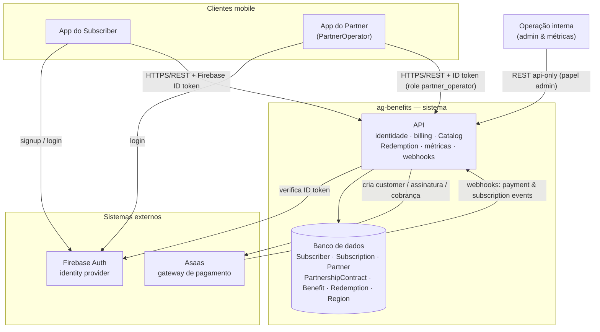

# ADR-001: Topologia cross-repo do MVP (C4 containers)

> Append-only: nunca reescreva. Decisão nova = novo ADR que substitui este.
> Use ADR para decisões que CRUZAM repos (contratos, protocolos, padrões compartilhados).

## Contexto
O MVP precisa de uma topologia de serviços definida **antes** dos AYDs por feature, para
que cada AYD assuma a fundação como dada e detalhe apenas seus contratos. O escopo
(REQ-001) é: **apps mobile do `Subscriber` e do `Partner` + `api`**, em **1 `Region`**
piloto, com administração interna de `Partner`/`PartnershipContract`/`Benefit`, **métricas de
negócio cross-`Partner` api-only** e **métricas do próprio `Partner` no app do `Partner`**. O produto delega identidade e pagamento a
terceiros (não somos meio de pagamento — ver [PROD-001](../product.md) e
[PDR-001](../product_decisions/PDR-001-savings-calculation.md)), então a topologia precisa
nomear esses sistemas externos e as fronteiras de "fonte da verdade".

Esta é a decisão de **nível arquitetural (C4 nível 1–2)**, não por feature — por isso o
diagrama de containers mora aqui (ver `_meta/conventions.md` §10). As decisões de auth e
pagamento têm ADR próprio ([ADR-002](ADR-002-autenticacao-autorizacao.md),
[ADR-003](ADR-003-pagamentos-ciclo-subscription.md)); aqui ficam só os containers e como
eles se relacionam.

## Decisão
A topologia do MVP tem **clientes mobile** (app do `Subscriber` e app do `Partner` —
possivelmente um único app com áreas distintas), a **api**, **um banco de dados** e **dois
sistemas externos** (Firebase, Asaas). A **administração interna** (cadastro) e as **métricas
de negócio cross-`Partner`** ficam na **própria api** (endpoints internos, sem UI dedicada); o
`Partner` acessa **as métricas do próprio `Partner`** pelo app do `Partner`.

| Container | Repo | Responsabilidade |
|-----------|------|------------------|
| **App do `Subscriber`** | `mobile` | Cliente do `Subscriber`: conta/login, `Subscription`, `Catalog` por `Region`, `Redemption` por leitura de QR, histórico/`Savings`. |
| **App do `Partner`** | `mobile` | Cliente do `PartnerOperator`: login e métricas do próprio `Partner`; participação no `Redemption` (fluxo a definir). **Possivelmente o mesmo app do `Subscriber`** com áreas distintas — viabilidade técnica decidida em TDR local. |
| **API** | `api` | Núcleo de domínio: identidade (verifica token), billing/`Subscription`, `Catalog`, registro confiável de `Redemption`+`Savings`, métricas internas, e os **webhooks** dos externos. Fonte da verdade do domínio. |
| **Banco de dados** | `api` | Persiste `Subscriber`, `Subscription`, `Partner`, `PartnershipContract`, `Benefit`, `Redemption`, `Region`. |

| Sistema externo | Papel | Fonte da verdade de |
|-----------------|-------|---------------------|
| **Firebase Auth** | Identity provider (signup/login/recuperação) | Credenciais e identidade de autenticação (detalhe em [ADR-002](ADR-002-autenticacao-autorizacao.md)). |
| **Asaas** | Gateway de pagamento (cartão + Pix Automático) | Estado de cobrança/assinatura; espelhamos `SubscriptionStatus` (detalhe em [ADR-003](ADR-003-pagamentos-ciclo-subscription.md)). |

**Fronteiras de fonte da verdade:** identidade no Firebase, billing no Asaas, **domínio no
nosso DB**. O `Subscriber` (perfil de domínio) vive no nosso DB chaveado por `firebase_uid`;
o estado de billing é **espelhado** do Asaas para o nosso `SubscriptionStatus` via webhook,
nunca redefinido por nós.

**Administração e métricas (RF-13/RF-14):** são endpoints **internos da api**, protegidos
por papel (ver ADR-002). No MVP, métricas são **consulta/exportação sobre o DB operacional**
— sem data warehouse/analytics dedicado (evitar over-engineering; `Region` já é dimensão de
primeira classe). O **app do `Partner`** expõe um recorte dessas métricas **limitado ao
próprio `Partner`** (RF-15/RF-16), pela mesma api e protegido por `role` (ver ADR-002).

**Comunicação:** mobile → api por **HTTPS/REST**, autenticado por *Firebase ID token*. Os
externos chamam a api de volta por **webhooks** (entrada de primeira classe: a api expõe
endpoint, valida assinatura e processa de forma **idempotente** — liga no RNF-02).

## Diagrama de containers (C4 nível 2)

## Alternativas consideradas
| Opção | Prós | Contras | Por que (não) escolhida |
|-------|------|---------|-------------------------|
| Mobile + api + externos (esta) | Mínima superfície; foca no fluxo central; cada lado com fonte da verdade clara | Admin sem UI no MVP | **Escolhida** — alinhada ao escopo do REQ-001 |
| Adicionar painel web/backoffice no MVP | Operação mais cômoda | Mais um repo/container; fora do escopo do MVP | Descartada — vira Next |
| Identidade e billing "caseiros" na api | Sem dependência externa | Reinventa segurança/PCI; lento e arriscado | Descartada — delegamos a Firebase/Asaas |
| Analytics/warehouse dedicado | Métricas robustas | Over-engineering para 1 `Region` | Descartada — query no DB operacional basta no MVP |

## Consequências / trade-offs
- **Positivas:** superfície enxuta; responsabilidades e fontes de verdade nítidas; AYDs por
  feature herdam esta base sem reabri-la; webhooks centralizam a sincronização de estado.
- **Negativas:** cadastro de `Partner`/`Benefit` e métricas de negócio cross-`Partner` sem UI
  no MVP (via processo/endpoint interno); dependência de dois fornecedores externos (lock-in
  mitigado por abstração no ADR-003 e pela fronteira de identidade no ADR-002).
- **Compliance (LGPD, RNF-04):** Firebase e Asaas processam PII; há **transferência
  internacional** no caso do Firebase. Registrar base legal/consentimento e tratar
  residência de dados (candidato a PDR/nota de compliance).
- **Impacto (IDs/repos afetados):** define a base para `api` e `mobile`; detalhada por
  [ADR-002] (auth) e [ADR-003] (pagamentos); consumida pelos próximos AYDs (a partir de
  AYD-001). A escolha de linguagem/framework de cada container é **local** (TDR no repo do
  serviço), fora deste ADR.
