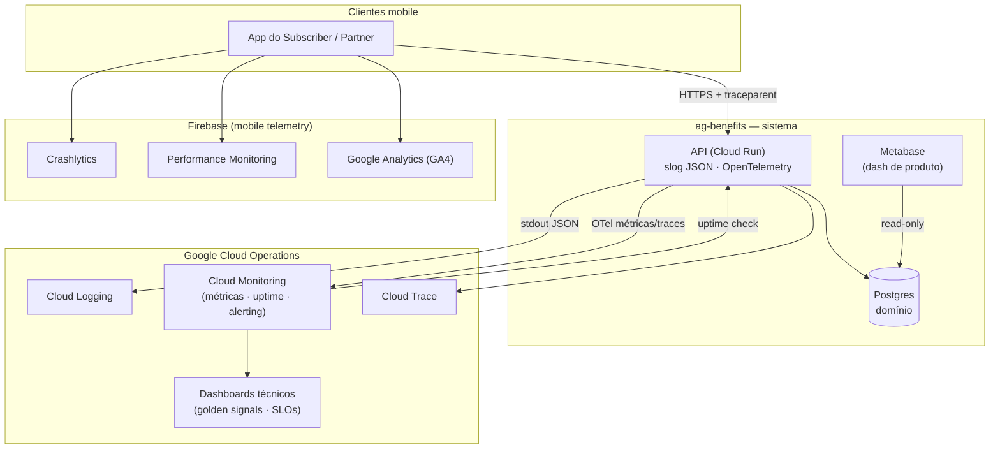

# ADR-005: Observabilidade — logs, métricas, traces e dashboards (stack gratuita)

> Append-only: nunca reescreva. Decisão nova = novo ADR que substitui este.
> Use ADR para decisões que CRUZAM repos (contratos, protocolos, padrões compartilhados).

## Contexto

Os RNFs do produto exigem observabilidade desde o início: **RNF-01** (latência do `Catalog`
< 2s e confirmação de `Redemption` < 3s), **RNF-06** ("confiança no número": todo
`Redemption` auditável, métricas verificáveis) e **RNF-07** (disponibilidade ≥ 99% no
piloto). Em paralelo, o **PROD-001** define KPIs de negócio (North Star = MRR; inputs =
`Savings` gerado e `Redemption`s/`Subscriber`) que precisam de uma superfície de consulta.

Hoje não há padrão de instrumentação. Sem decidir isto **agora**, cada feature (api e
mobile) vai logar e medir de um jeito, e retrofitar observabilidade depois é caro. A decisão
**cruza repos** (mobile + api), **introduz novos containers/sistemas externos** (logo
estende a topologia C4 do [ADR-001](ADR-001-topologia-cross-repo.md)) e fixa um **padrão
compartilhado** que toda implementação posterior segue — por isso é um ADR, não um TDR.

Restrições de partida: **custo zero** (free tiers), e aproveitar o stack que já existe —
a api roda em **Google Cloud (Cloud Run)** e o `mobile`/auth já usam **Firebase** (mesma
org Google). Decisões de produto sobre **o que** medir já moram no PROD-001/REQ-001; aqui
decidimos **como** instrumentar e **onde** os dados vivem.

## Decisão

Adotamos uma stack de observabilidade **consolidada no Google** (gratuita nos free tiers),
com **três sinais** (logs, métricas, traces) e **dois dashboards** (técnico e de produto). A
instrumentação é **agnóstica de fornecedor** na borda (stdout estruturado + OpenTelemetry),
para manter o backend substituível — mesmo princípio da porta `PaymentGateway` (ADR-003).

### Stack por container

| Container | Sinal | Ferramenta (free) | Como |
|-----------|-------|-------------------|------|
| **api** (Cloud Run) | Logs | **Cloud Logging** | `slog` emite JSON no stdout; Cloud Run ingere automaticamente. |
| **api** | Métricas | **Cloud Monitoring** | RED **nativo** do Cloud Run (`request_count`, `request_latencies`) + métricas de negócio via OpenTelemetry. |
| **api** | Traces | **Cloud Trace** | OpenTelemetry SDK; trace context correlaciona logs↔traces. |
| **api** | Uptime | **Cloud Monitoring Uptime Checks** | check externo no `GET /healthz` (RNF-07). |
| **mobile** | Crashes | **Firebase Crashlytics** | SDK; crash-free users %. |
| **mobile** | Performance | **Firebase Performance Monitoring** | app start, render de tela, latência de rede (HTTP automático). |
| **mobile** | Produto | **Google Analytics (GA4) for Firebase** | eventos de negócio (funil de onboarding, `Redemption`, `Subscription`). |
| **negócio** | Dash de produto | **Metabase** (OSS self-hosted) | sobre o Postgres de domínio (role read-only). |
| **técnico** | Dash de KPIs | **Cloud Monitoring dashboards** | golden signals + SLOs dos RNFs. |
| **ambos** | Alerting | **Cloud Monitoring alerting policies** | rotas para e-mail/chat. |

### Padrão de instrumentação (cross-repo — o que toda feature segue)

1. **Logs estruturados (JSON).** Campos mínimos: `severity`, `time`, `message`, `service`,
   `env`, `trace`, `route`, `method`, `status`, `latency_ms`. Quando autenticado, inclui o
   `subscriber_id` (id **de domínio**, ADR-002) — **nunca** `firebase_uid`, e-mail, token ou
   PII. Erros embrulham a causa (`%w`).
2. **Correlation/trace id (protocolo cross-repo).** Toda requisição carrega um id de
   correlação propagado `mobile → api` (header `traceparent`, padrão W3C Trace Context;
   tolera o `X-Cloud-Trace-Context` que o Cloud Run injeta). A api **propaga** o id para os
   logs e traces; é o que permite rastrear uma chamada ponta a ponta. O contrato concreto do
   header está no AYD que materializa este ADR.
3. **Métricas RED por endpoint** (Rate, Errors, Duration) — no MVP vêm prontas do Cloud Run;
   features só precisam manter rotas nomeadas/consistentes.
4. **Métricas/eventos de negócio.** Todo evento de domínio relevante emite um sinal
   (ex.: `Redemption` criado, `Subscription` ativada). Nomes em inglês, alinhados ao GLO.
5. **SLOs amarrados aos RNFs:** `Catalog` p95 < 2s e `Redemption` p95 < 3s (RNF-01);
   disponibilidade ≥ 99% (RNF-07); cobertura de auditoria de `Redemption` (RNF-06).
6. **Postura LGPD (RNF-04):** minimização de PII em logs/métricas; telemetria a Google
   (Cloud Operations, Firebase/GA4) é **transferência internacional** de dados — registrar
   base legal/consentimento e definir retenção. Ver "questões em aberto".

### Fronteira de portabilidade

A api **não** acopla regra de negócio ao fornecedor de telemetria: `slog` escreve no stdout
(qualquer coletor lê) e métricas/traces saem por **OpenTelemetry** (exporter trocável). Logo,
trocar Cloud Operations por Grafana/Prometheus é trocar exporter/coletor, não código de
domínio. O **como** concreto na api (libs, handler `slog`, exporter) é decisão local → TDR no
`api`.

## Diagrama de containers (C4 nível 2 — observabilidade, estende o ADR-001)

## Alternativas consideradas

| Opção | Prós | Contras | Por que (não) escolhida |
|-------|------|---------|-------------------------|
| **Google Cloud Operations + Firebase + Metabase** (esta) | Nativo do Cloud Run/Firebase (RED de graça, logs auto-ingeridos, correlação log↔trace); zero novo fornecedor; free tiers generosos | Lock-in Google (mitigado por OTel/stdout); PII a terceiro (LGPD) | **Escolhida** — menor atrito dado o stack atual |
| Grafana Cloud free tier (Loki/Prometheus/Tempo) | Hosted, agnóstico de cloud; um só painel | Soma fornecedor; precisa exportar tudo; sem o "de graça" do Cloud Run | Descartada para o MVP — reavaliável (instrumentação OTel já permite migrar) |
| Self-hosted Prometheus+Grafana+Loki | 100% free, retenção ilimitada, controle total | Vocês operam/mantêm; precisa host dedicado | Descartada no MVP — over-ops para 1 `Region` |
| Sem padrão (cada feature decide) | Zero esforço inicial | Telemetria inconsistente; retrofit caro; quebra RNF-06 | Descartada — anula o objetivo de padronizar cedo |
| Dash de produto sobre eventos (só GA4/Looker) | Bom para funil/engajamento | KPIs financeiros (MRR/`Savings`) vivem no DB, não em eventos | Parcial — GA4 complementa; verdade financeira fica no Metabase/DB |

## Consequências / trade-offs

- **Positivas:** observabilidade desde a 1ª feature com padrão único; RED e ingestão de logs
  praticamente "de graça" no Cloud Run; correlação logs↔traces nativa; KPIs de produto direto
  da fonte da verdade (DB) via Metabase; instrumentação portável (OTel/stdout).
- **Negativas:** dependência do ecossistema Google para telemetria (lock-in mitigado por
  OTel); Metabase é um container a hospedar/atualizar; SLOs/limites iniciais são palpites a
  calibrar no piloto.
- **Compliance (LGPD, RNF-04):** Cloud Operations e Firebase/GA4 processam dados fora do BR
  (transferência internacional, como já registrado em ADR-001/002). Exige base legal,
  minimização de PII em telemetria e política de retenção — candidato a PDR/nota de
  compliance.
- **Impacto (IDs/repos afetados):** estende a topologia do **ADR-001** (novos containers de
  telemetria) sem reescrevê-lo; define o padrão de instrumentação para `api` e `mobile`;
  é materializado pelo **AYD-002@context** (rollout + contrato do header de correlação), que
  gera SPEC-002@api e SPEC-002@mobile. O **como** concreto na api é detalhado em TDR local.
