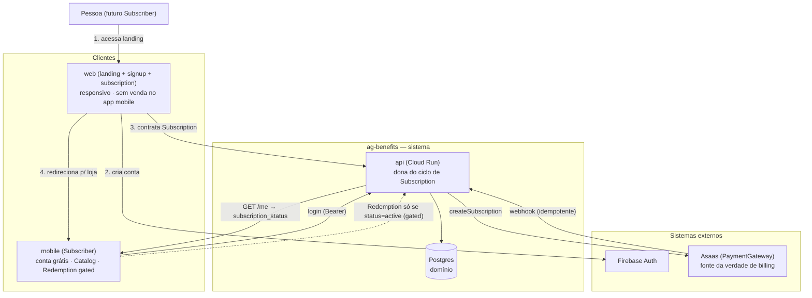

# ADR-006: Conformidade de billing com App Store/Play — assinatura na web (Asaas), mobile sem venda; fallback IAP

> Append-only: nunca reescreva. Decisão nova = novo ADR que substitui este.
> Use ADR para decisões que CRUZAM repos (contratos, protocolos, padrões compartilhados).

## Contexto

O [ADR-003](ADR-003-pagamentos-ciclo-subscription.md) decidiu **Asaas** atrás da porta
`PaymentGateway` como motor de recorrência da `Subscription`, e assumiu (implicitamente) que
"o **mobile** inicia a contratação". Essa premissa **ignora as regras das lojas de
aplicativos** (Apple App Store e Google Play), que governam **como** um app pode cobrar.

A questão central não é "pode gateway externo?", e sim **como Apple/Google classificam a
nossa `Subscription`**:

- **Bem/serviço digital consumido no app** (acesso a features) → **IAP/Play Billing
  obrigatório** (comissão ~15–30%; ~10–20% no Google em 2026).
- **Bem/serviço do mundo real consumido fora do app**, **transacionado pelo app** (uma
  corrida, uma refeição, um voucher) → cobrança **fora** do IAP é permitida/exigida.

Analisando honestamente o nosso caso: o `Subscriber` paga **a nós** por **acesso** ao
`Catalog` e à capacidade de fazer `Redemption`. **Nós não intermediamos a transação física**
entre `Subscriber` e `Partner` (o desconto acontece direto no balcão; nada do valor da compra
passa por nós). Logo, o que vendemos é **acesso/feature-unlock** — a definição **literal de
bem digital** da Apple. A tese "serviço físico" (descontos presenciais) é **arguível**, mas é
**aposta**, não isenção clara: não somos "reader app" (categoria fechada: jornais, livros,
áudio, vídeo, cloud) nem intermediamos a transação real. **Probabilidade alta de a Apple
exigir IAP** se a venda ocorrer dentro do app (o Google é mais permissivo, mas mantemos um
desenho único).

As regras de rejeição relevantes (Apple, principal fonte de risco):
- **3.1.1** — venda de bem digital exige IAP; **anti-steering**: o app não pode ter botões/
  links/CTA que direcionem a compra para fora do IAP.
- **2.1 (App Completeness)** — app "vazio" atrás de paywall externo, ou sem como o revisor
  testar, é rejeitado.
- **5.1.1** — não travar features não-atreladas à conta atrás de registro; quem tem criação
  de conta precisa de **exclusão de conta**; **Sign in with Apple** se houver login social.

Decisão **cruza repos** (api, mobile e — como consequência — **reintroduz `web`**) e muda uma
premissa do ADR-003 → por isso é um ADR (complementa o ADR-003, não o substitui).

## Decisão

**Não vendemos a `Subscription` dentro do app.** Evitamos a briga de classificação **não
acionando o gatilho de IAP**: o app não vende nada e não faz steering. A contratação vive na
**web**, via Asaas (ADR-003). O mobile é uma superfície **gratuita** que só **lê** o
`SubscriptionStatus`.

### 1. Assinatura exclusivamente na web (Asaas)
A `Subscription` é contratada **apenas na web**, com pagamento via **Asaas** (cartão / Pix
Automático — ADR-003). A api permanece dona do ciclo de `SubscriptionStatus` (webhooks
idempotentes, mapa de estados do ADR-003). **Nenhum app mobile** (iOS ou Android) inicia,
processa ou linka a contratação.

### 2. App web mínimo (responsivo, mobile-first)
Reintroduzimos o repo **`web`** no MVP com um escopo **mínimo**:
`landing page → criação de conta (Firebase) → contratação da Subscription (Asaas) →
redirecionamento para as lojas (Android/iOS)`. É **responsivo para mobile** (o usuário
tipicamente chega pelo celular). É também onde mora o **funil de aquisição/conversão** —
já que o app não pode conduzir à compra.

### 3. App mobile: grátis, sem venda, `Redemption` gated (igual nas duas plataformas)
Para **iOS e Android** (mesma UX, por simplicidade e paridade):
- **Cria conta grátis** in-app (signup Firebase — AYD-001) e **navega o `Catalog`**
  (browse permitido sem `Subscription` ativa; satisfaz 5.1.1 e dá valor real ao app).
- **Oculta/desabilita o botão de `Redemption`** quando `subscription_status != active`
  (gate por RN-01). Mensagem, se houver, **neutra** (ex.: "Recurso para assinantes").
- **Sem venda e sem steering:** o app **não** vende, **não** linka e **não** instrui onde
  assinar. Conversão acontece fora (web/landing).

### 4. Requisitos de loja como critério de aceite (cross-repo)
- **Exclusão de conta** in-app (Apple 5.1.1 v; equivalente de exclusão de dados no Google).
- **Sign in with Apple** no iOS **se** houver login social (Google/Facebook via Firebase).
- **Demo account com `Subscription` ativa** + cartão sandbox para o review (resolve 2.1).
- **Reviewer notes** explicando o modelo (assinatura web; app grátis que lê status).
- **Browse de `Catalog` sem `Subscription`** (mata "app vazio"/2.1).

### 5. Fallback: IAP via RevenueCat (preço maior no mobile)
Se as lojas **rejeitarem** o modelo acima e exigirem venda in-app, o fallback é **IAP/Play
Billing via RevenueCat** (abstração de store billing), entrando como **adaptador atrás da
porta `PaymentGateway`** (ADR-003) — sem tocar a regra de domínio. Nesse caminho, o **preço da
`Subscription` no mobile é maior** que na web, para **compensar a comissão (~15–30%)** das
lojas (a calibração de preço é decisão de produto — candidata a **PDR** quando/se acionado).
**Não construímos o fallback agora**; deixamos a porta pronta e validamos as lojas cedo.

## Alternativas consideradas

| Opção | Prós | Contras | Por que (não) escolhida |
|-------|------|---------|-------------------------|
| **Web-only + mobile lê status + fallback IAP** (esta) | 0% de comissão; **sidestepa a classificação** (app não vende → nada a rejeitar); Asaas/ADR-003 intacto; fallback claro | Funil de conversão fora do app (fricção); exige web mínima; disciplina anti-steering | **Escolhida** |
| Vender via Asaas **dentro** do app (tese "serviço físico") | Melhor UX; 0% comissão | **Aposta alta**: não somos reader app nem intermediamos transação física → risco real de rejeição (3.1.1) | Descartada — risco de classificação que nós mesmos não sustentamos |
| **IAP/Play Billing nativo** como caminho principal | 100% compliant; checkout in-app | Perde 15–30%; quebra o motor Asaas no mobile; lock-in de store | Descartada como **principal**; vira **fallback** (item 5) |
| App "reader-like" sem nem conta grátis (login wall puro) | Simples | Alto risco 2.1 (app vazio); pior conversão | Descartada — sem valor grátis, reprova no review |

## Diagrama de containers (C4 nível 2 — billing/conformidade, estende o ADR-001)

## Consequências / trade-offs

- **Positivas:** evita comissão de loja no caminho principal; **não depende** de vencer a
  classificação digital×físico; preserva Asaas e a porta `PaymentGateway` (ADR-003);
  fallback de baixo atrito (RevenueCat como adaptador); app com valor grátis (browse) que
  reduz risco de 2.1.
- **Negativas:** **funil de conversão sai do app** (custo de aquisição/UX — quem instala
  primeiro pela loja não consegue assinar de dentro); reintroduz uma superfície **`web`** a
  construir/manter; exige disciplina anti-steering contínua nos releases; o fallback IAP, se
  acionado, traz preço diferenciado e complexidade de store billing.
- **Compliance:** modelo desenhado para passar em Apple e Google; risco residual de a Apple
  ainda exigir IAP (mitigado por não vender no app + validação pré-submissão + reviewer
  notes). Mantém pendência LGPD do ADR-001/003 (PII no Asaas, transferência internacional).
- **Impacto (IDs/repos afetados):**
  - **`web`** reentra no MVP (muda o "web fora" do **REQ-001** e do **ROAD-001**).
  - **api:** endpoints de contratação/cancelamento e webhook **servem a web**, não o mobile;
    `GET /me` expõe `subscription_status` (read-only) ao mobile.
  - **mobile:** browse de `Catalog` sem `Subscription`, gate do `Redemption`, **exclusão de
    conta** e **Sign in with Apple** entram no escopo (propaga para **AYD-001**/onboarding e
    para o futuro AYD de `Catalog`).
  - **AYD-003** (billing) passa a materializar contratos em **api + web** (+ leitura no
    mobile), não "mobile inicia o checkout".
  - **Fallback IAP/RevenueCat** entra como adaptador da porta `PaymentGateway` (ADR-003);
    preço diferenciado no mobile é candidato a **PDR** quando acionado.
</content>
</invoke>
