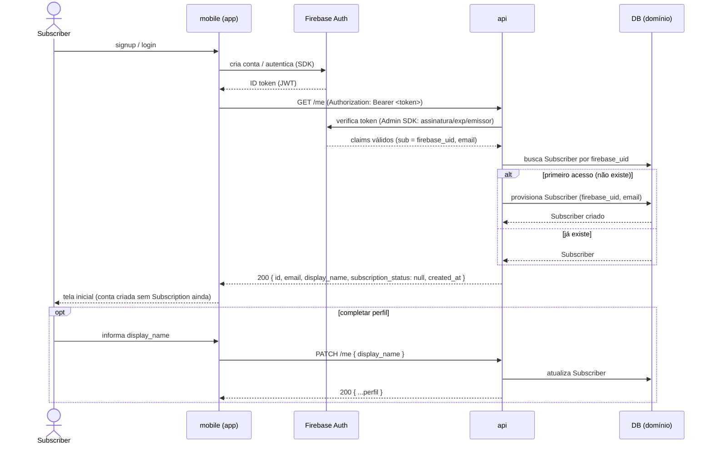

# AYD-001: Onboarding do Subscriber (identidade/conta)

> Análise & Design cross-repo. Decide QUAIS repos a feature toca, o PAPEL de cada um
> e os CONTRATOS entre eles. Daqui nascem N SPECs (uma por repo afetado).

## Objetivo

Atende o **RF-01** (`Subscriber` cria conta e autentica). Resultado esperado: uma pessoa
baixa o app, faz signup/login pelo Firebase e passa a ter um **registro de domínio
`Subscriber`** no nosso DB, chaveado por `firebase_uid` — pronto para, num passo seguinte,
contratar a `Subscription`.

**Escopo desta feature = identidade/conta apenas.** Não inclui contratação nem cobrança da
`Subscription` (RF-02/03/04, [ADR-003](../architecture_decisions/ADR-003-pagamentos-ciclo-subscription.md))
— isso vira um AYD próprio. Aqui o `Subscriber` nasce **sem `Subscription` ativa**; por
RN-01 ele ainda **não** pode realizar `Redemption`.

Esta é a primeira fatia vertical do produto: existe para **validar a tubulação** da
[ADR-001](../architecture_decisions/ADR-001-topologia-cross-repo.md) (mobile → Firebase →
api → DB) e o protocolo de auth da
[ADR-002](../architecture_decisions/ADR-002-autenticacao-autorizacao.md) ponta a ponta.

## Repos afetados e papéis

| Repo | Papel nesta feature | SPEC gerada |
|------|---------------------|-------------|
| mobile | Faz signup/login/recuperação direto no **Firebase** (SDK), obtém o **ID token** e o envia em `Authorization: Bearer` nas chamadas à api. Tela de cadastro/login e de perfil mínimo. | SPEC-001@mobile |
| api    | **Verifica** o ID token (Firebase Admin SDK), **resolve/provisiona** o `Subscriber` por `firebase_uid`, expõe o perfil de domínio e permite completar dados mínimos. | SPEC-001@api |

> `web` **não** é afetado: no MVP não há web do `Subscriber` (REQ-001, "Fora").
> A autenticação do `PartnerOperator` (RF-15) é outra feature/AYD — embora compartilhe o
> mesmo protocolo da ADR-002, o ator e o `role` são distintos.

## Contratos (fonte da verdade)

Toda chamada autenticada leva `Authorization: Bearer <Firebase ID token>` (ADR-002).
A identidade de autenticação vive no Firebase; o **perfil de domínio** vive no nosso DB.

```
GET /me
  auth: Bearer <Firebase ID token>   (role: subscriber)
  efeito: resolve o Subscriber pelo firebase_uid (claim `sub`).
          No PRIMEIRO acesso autenticado sem Subscriber correspondente,
          a api PROVISIONA o registro (ADR-002 §4) — idempotente por firebase_uid.
  res 200: {
    id: string,                 // id de domínio (nosso)
    email: string,              // do token Firebase
    display_name: string|null,
    subscription_status: null,  // sempre null neste AYD (sem billing ainda)
    created_at: string          // ISO-8601
  }
  erros:
    401  token ausente/inválido/expirado

PATCH /me
  auth: Bearer <Firebase ID token>   (role: subscriber)
  req:  { display_name?: string }
  res 200: { ...mesmo objeto de GET /me }
  erros:
    401  token ausente/inválido/expirado
    422  payload inválido (ex.: display_name vazio/curto)
```

**Notas de contrato:**
- **Provisionamento é implícito e idempotente:** não há `POST /subscribers`. O `Subscriber`
  nasce no primeiro `GET /me` autenticado (ADR-002). Chamadas concorrentes do primeiro
  acesso não devem criar duplicatas (unicidade por `firebase_uid`).
- `email` é a fonte do token, **não** é editável aqui (muda no Firebase).
- `subscription_status` aparece no payload já agora (sempre `null`) para o mobile não precisar
  trocar o contrato quando a `Subscription` entrar; valores `active|past_due|canceled` chegam
  no AYD de billing.

## Modelo de domínio afetado

`Subscriber` (termo GLO) — registro de domínio criado neste AYD:

| Campo | Tipo | Origem | Notas |
|-------|------|--------|-------|
| `id` | id | nosso DB | chave de domínio |
| `firebase_uid` | string | claim `sub` do token | **único**; ligação auth↔domínio (ADR-002) |
| `email` | string | token Firebase | espelhado do IdP |
| `display_name` | string\|null | `PATCH /me` | perfil mínimo |
| `created_at` / `updated_at` | timestamp | nosso DB | auditoria |

> O **`SubscriptionStatus`** (GLO) **não** é materializado neste AYD — chega com o AYD de
> billing (ADR-003). Até lá, o `Subscriber` existe sem `Subscription` e não habilita
> `Redemption` (RN-01).

## Fluxo cross-repo



## Decisões relacionadas

- [ADR-001](../architecture_decisions/ADR-001-topologia-cross-repo.md) — topologia
  mobile → Firebase → api → DB que esta fatia valida.
- [ADR-002](../architecture_decisions/ADR-002-autenticacao-autorizacao.md) — protocolo de
  auth e regra de provisionamento do `Subscriber` por `firebase_uid` (fonte direta dos
  contratos acima).
- Termos canônicos no [GLO](../_meta/glossary.md).

> Nenhuma decisão **nova** de contrato é introduzida aqui — o AYD apenas materializa, em
> endpoints, o que a ADR-002 já decidiu. Se surgir contrato novo, cria-se um ADR.

## Fora de escopo / questões em aberto

- **Billing/`Subscription`** (RF-02/03/04, ADR-003): AYD próprio. Aqui `subscription_status`
  é sempre `null`.
- **Auth do `PartnerOperator`** (RF-15): mesmo protocolo (ADR-002), ator/`role` distintos →
  outra feature/AYD.
- **Health check / smoke test da topologia:** não é conteúdo de AYD (não tem contrato de
  domínio); é bootstrap de cada serviço (referencia ADR-001).
- **Versionamento da api (prefixo `/vN`):** decisão transversal, não de feature. No MVP os
  caminhos ficam **sem prefixo de versão** (controlamos o único cliente, o `mobile`); se/quando
  for preciso versionar, decide-se a estratégia uma única vez (candidato a ADR), não por AYD.
- **LGPD (RNF-04):** consentimento/base legal e a transferência internacional de PII pelo
  Firebase (ADR-002) — definir onde/quando capturar o consentimento no onboarding
  (candidato a PDR). 
- **Modelagem "conta sem Subscription":** o GLO define `Subscriber` como pessoa **com
  `Subscription` ativa**; aqui o registro nasce antes disso (seguindo ADR-002, que provisiona
  no 1º acesso). Confirmar se mantemos um único `Subscriber` com `subscription_status` ou se
  separamos "conta" de "assinante" — revisitar ao escrever o AYD de billing.
