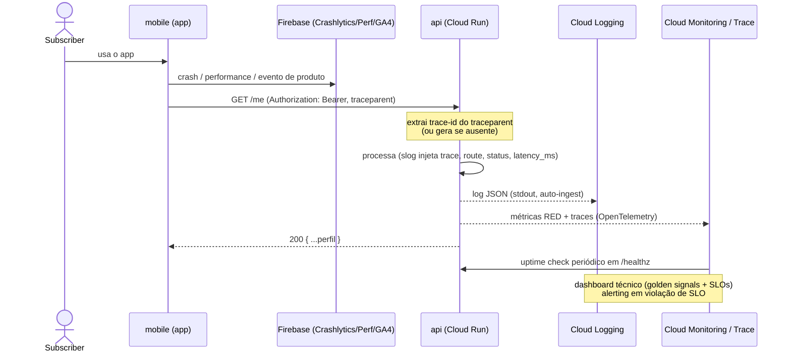

# AYD-002: Baseline de observabilidade (logs, métricas, traces e dashboards)

> Análise & Design cross-repo. Decide QUAIS repos a feature toca, o PAPEL de cada um
> e os CONTRATOS entre eles. Daqui nascem N SPECs (uma por repo afetado).

## Objetivo

Materializa o [ADR-005](../architecture_decisions/ADR-005-observabilidade.md) numa **fatia de
baseline**: instrumentar `api` e `mobile` com o padrão único de observabilidade **antes** das
próximas features, atendendo **RNF-01** (latência), **RNF-06** (auditabilidade/confiança no
número) e **RNF-07** (disponibilidade), e disponibilizando **dois dashboards** — um **técnico**
(golden signals + SLOs) e um **de produto** (KPIs do PROD-001).

Resultado esperado: toda chamada `mobile → api` é rastreável ponta a ponta por um **id de
correlação**; logs/métricas/traces da api fluem para o Cloud Operations; o mobile reporta
crashes/performance/eventos via Firebase; e existem dois dashboards consultáveis. A partir
daqui, **cada nova feature já nasce instrumentada** pelo mesmo padrão.

**Escopo = baseline transversal.** Não cria endpoints de domínio novos; usa os já existentes
(`/healthz`, `/me`) como primeira superfície instrumentada. Os endpoints de **métricas de
negócio agregadas** (RF-14) e **métricas do próprio `Partner`** (RF-16) são features de
domínio próprias (AYDs futuros) — este AYD entrega a **fundação** que elas vão reusar.

## Repos afetados e papéis

| Repo | Papel nesta feature | SPEC gerada |
|------|---------------------|-------------|
| api    | Emite logs JSON estruturados (`slog`) no stdout; expõe métricas/traces via OpenTelemetry → Cloud Operations; **propaga** o id de correlação para logs/traces; mantém `/healthz` apto a uptime check; emite métricas/eventos de negócio. | SPEC-002@api |
| mobile | Integra Firebase Crashlytics, Performance Monitoring e GA4; **gera e envia** o header de correlação em toda chamada à api; emite eventos de produto do funil (onboarding, `Subscription`, `Redemption`). | SPEC-002@mobile |

> `web` **não** é afetado (fora do MVP, REQ-001). O **dash de produto** (Metabase sobre
> Postgres) e o **dash técnico** (Cloud Monitoring) são operados pela api/operação interna,
> não geram SPEC de cliente.

## Contratos (fonte da verdade)

### 1. Header de correlação (`mobile → api`)

Único contrato **novo** cross-repo desta feature. Segue o padrão **W3C Trace Context**.

```
Toda requisição autenticada ou não à api leva:
  traceparent: 00-<trace-id:32hex>-<span-id:16hex>-<flags:2hex>
    - o mobile GERA o traceparent por requisição (raiz do trace);
    - se ausente, a api gera um (Cloud Run injeta X-Cloud-Trace-Context como fallback);
    - a api PROPAGA o trace-id para logs (campo `trace`) e traces (Cloud Trace).
  (opcional) tracestate: <vendor-state>   # reservado; ignorado no MVP
```

### 2. Schema de log estruturado (api → Cloud Logging)

```
{
  "severity":    "INFO|WARNING|ERROR",   // mapeado para níveis do Cloud Logging
  "time":        "ISO-8601",
  "message":     string,
  "service":     "ag-benefits-api",
  "env":         "prod|staging|dev",
  "trace":       "<trace-id>",            // correlaciona com Cloud Trace
  "route":       "/me",                   // rota nomeada, sem ids voláteis
  "method":      "GET|POST|PATCH|...",
  "status":      200,
  "latency_ms":  12,
  "subscriber_id": "<id de domínio>"      // só quando autenticado; NUNCA firebase_uid/email/PII
}
```

### 3. Métricas e eventos de negócio (nomes canônicos, em inglês)

```
RED (por rota) — nativo do Cloud Run, sem código:
  request_count{route,method,status}
  request_latencies{route}               // base dos SLOs RNF-01

Negócio (emitidos pela api e/ou GA4, conforme a feature):
  subscriber_provisioned_total           // 1º acesso (AYD-001)
  subscription_activated_total           // billing (AYD futuro)
  redemption_created_total{region}       // Redemption confirmado (AYD futuro)
  savings_amount_total{region}           // soma de Savings (RNF-06)
```

> Estes nomes são o **vocabulário inicial**; cada AYD de feature adiciona os seus, sempre em
> inglês e alinhados ao [GLO](../_meta/glossary.md). A SPEC@api não redefine este contrato.

## Modelo de domínio afetado

Nenhuma entidade de domínio nova. A telemetria **referencia** termos do GLO (`Subscriber`,
`Redemption`, `Savings`, `Region`) nos nomes de métricas/eventos, mas **não persiste** modelo
novo. O `subscriber_id` em logs é o **id de domínio** (ADR-002), nunca o `firebase_uid`.

## Fluxo cross-repo



## Decisões relacionadas

- [ADR-005](../architecture_decisions/ADR-005-observabilidade.md) — decisão de stack e padrão
  de instrumentação (fonte direta dos contratos acima).
- [ADR-001](../architecture_decisions/ADR-001-topologia-cross-repo.md) — topologia que o
  ADR-005 estende com os containers de telemetria.
- [ADR-002](../architecture_decisions/ADR-002-autenticacao-autorizacao.md) — origem do
  `subscriber_id` (id de domínio) usado em logs; PII e LGPD.
- KPIs de produto: [PROD-001](../product.md) (OKRs/North Star). Termos no
  [GLO](../_meta/glossary.md).

> Nenhuma decisão **nova** de stack é introduzida aqui — o AYD materializa o ADR-005 em
> contratos (header de correlação, schema de log, vocabulário de métricas). Mudança de stack
> → novo ADR.

## Fora de escopo / questões em aberto

- **Endpoints de métricas de domínio** (RF-14 agregadas api-only; RF-16 métricas do próprio
  `Partner` no app): features próprias (AYDs futuros) que **consomem** esta fundação.
- **Tracing distribuído entre serviços:** no MVP há um só backend (api); o trace cobre
  `mobile → api`. Propagação a Asaas/Firebase fica fora.
- **LGPD (RNF-04):** consentimento/base legal para telemetria e analytics (GA4/Crashlytics) e
  transferência internacional — definir onde capturar no onboarding (candidato a PDR, alinhado
  às pendências de ADR-001/002/005).
- **Política de retenção e custo:** confirmar que os volumes do piloto cabem nos free tiers;
  definir retenção de logs/métricas. Candidato a TDR/nota operacional.
- **Calibração de SLOs e limites de alerta:** valores iniciais (p95 < 2s/3s, ≥ 99%) são
  palpites informados; ajustar com dados do piloto.
- **Hospedagem do Metabase:** onde roda (Cloud Run vs VM) e acesso read-only ao Postgres
  (idealmente réplica de leitura) — decisão local/operacional.
