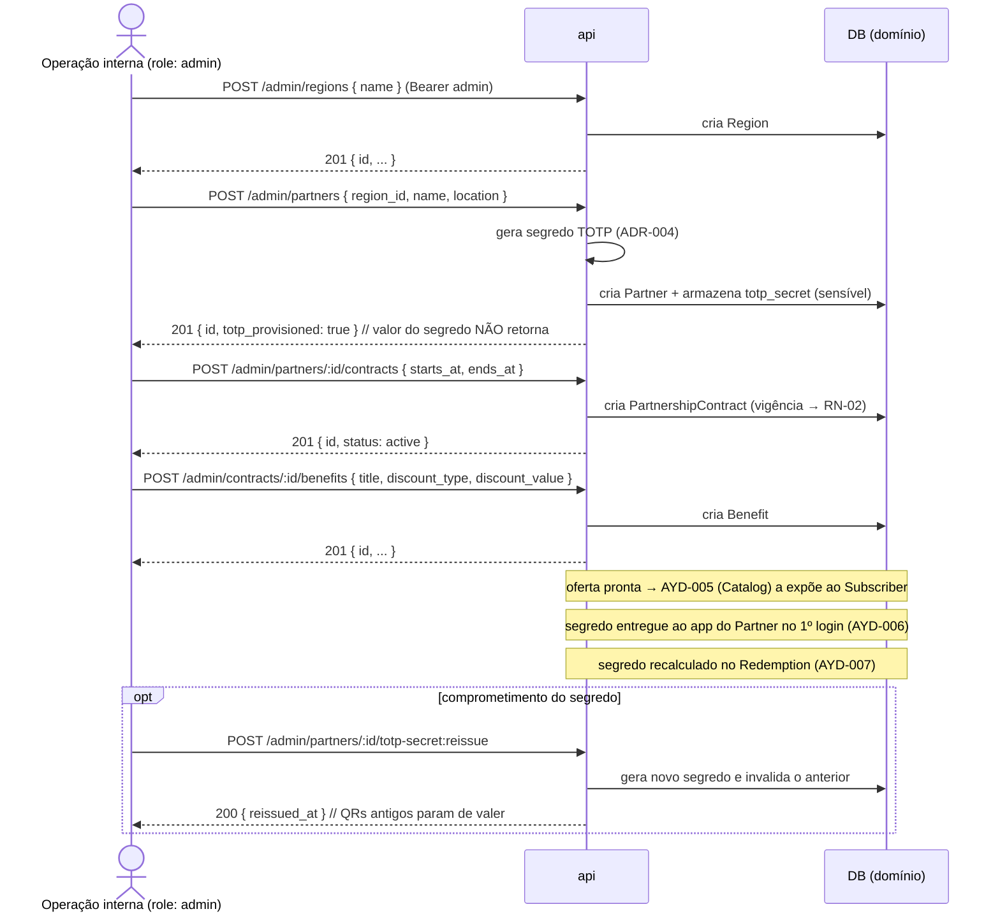

# AYD-004: Administração interna + modelo de domínio da oferta

> Análise & Design cross-repo. Decide QUAIS repos a feature toca, o PAPEL de cada um
> e os CONTRATOS entre eles. Daqui nascem N SPECs (uma por repo afetado).

## Objetivo

Atende o **RF-13** (administração interna de `Partner`/`PartnershipContract`/`Benefit` e
provisionamento do segredo TOTP do `Partner`). Resultado esperado: a operação interna
consegue **cadastrar e editar** a `Region` piloto, os `Partner`s, seus `PartnershipContract`s
e os `Benefit`s, e cada `Partner` passa a ter um **segredo TOTP** gerado e reemissível — de
forma que, nas features seguintes, exista **oferta para exibir** (`Catalog`, AYD-005) e
**resgate para confirmar** (`Redemption`, AYD-007).

Esta é a feature que **materializa o modelo de domínio da oferta**: até aqui o produto só
tinha `Subscriber`/`Subscription` (AYD-001/003); aqui nascem as entidades do lado do
`Partner`. É **pré-requisito** de AYD-005 (`Catalog` por `Region`), AYD-006 (app do
`Partner`) e AYD-007 (`Redemption`).

**Escopo:** endpoints **internos** (`role: admin`, api-only — RF-13) de CRUD de `Region`,
`Partner`, `PartnershipContract` e `Benefit`, mais a **geração/reemissão** do segredo TOTP
por `Partner`. **Não** inclui a *entrega* do segredo ao app do `Partner` (1º login do
`PartnerOperator` — AYD-006), nem o consumo da oferta no `Catalog`/`Redemption` (AYD-005/007).
Sem UI dedicada (RF-13): a operação usa os endpoints diretamente.

## Repos afetados e papéis

| Repo | Papel nesta feature | SPEC gerada |
|------|---------------------|-------------|
| api | **Dono do modelo de domínio da oferta** (ADR-001). Expõe os endpoints internos `role: admin` de CRUD de `Region`/`Partner`/`PartnershipContract`/`Benefit`; **gera e armazena** o segredo TOTP por `Partner` na criação e permite **reemissão** (ADR-004); valida vigência (RN-02) e as regras de desconto do `Benefit` (PDR-001). | SPEC-004@api |

> `mobile` e `web` **não** são afetados: RF-13 é **api-only, sem UI** (REQ-001, "Fora": sem
> painel/self-cadastro do `Partner`). A *exibição* do QR no app do `Partner` (RF-17) e a
> *entrega* do segredo no 1º login (RF-15) são do **AYD-006**; aqui o segredo apenas **nasce**
> e é **reemissível**.

## Contratos (fonte da verdade)

Todos os endpoints são **internos** e exigem `Authorization: Bearer <Firebase ID token>` com
**custom claim `role = admin`** (ADR-002 §autorização). Sem UI; chamadas feitas pela operação
interna. Caminhos sob o prefixo `/admin`. Valores monetários em **centavos (int)** ou decimal
— a convergir na SPEC; aqui usamos `number` em R$ por clareza de contrato.

```
POST /admin/regions                        (admin)
  req:  { name: string, active?: boolean }          // active default true
  res 201: { id, name, active, created_at }
  erros: 401 ; 403 (role != admin) ; 422 (name vazio)

GET  /admin/regions                        (admin)
  res 200: [ { id, name, active, created_at } ]
  erros: 401 ; 403
```

```
POST /admin/partners                       (admin)
  efeito: cria o Partner na Region e GERA o segredo TOTP (ADR-004), armazenado
          de forma sensível (nunca retornado em leitura).
  req:  {
    region_id: string,
    name: string,
    description?: string,
    location?: { address?: string, lat?: number, lng?: number }   // RF-06 (detalhe/proximidade)
  }
  res 201: {
    id, region_id, name, description, location,
    totp_provisioned: true,           // segredo gerado; valor NÃO trafega aqui
    active: true, created_at
  }
  erros: 401 ; 403 ; 404 (region_id inexistente) ; 422 (payload inválido)

GET   /admin/partners            (admin)   res 200: [ { ...Partner sem segredo } ]
GET   /admin/partners/:id        (admin)   res 200: { ...Partner sem segredo, contracts: [...] }
PATCH /admin/partners/:id        (admin)
  req:  { name?, description?, location?, active? }   // não altera region_id nem segredo
  res 200: { ...Partner }
  erros: 401 ; 403 ; 404 ; 422

POST  /admin/partners/:id/totp-secret:reissue   (admin)   — reemissão (ADR-004)
  efeito: gera NOVO segredo e INVALIDA o anterior imediatamente (QRs antigos param de valer).
  res 200: { id, totp_provisioned: true, reissued_at }
  erros: 401 ; 403 ; 404
```

```
POST  /admin/partners/:id/contracts        (admin)        — PartnershipContract
  req:  { starts_at: string, ends_at: string|null }       // ISO-8601; ends_at null = aberto
  res 201: { id, partner_id, starts_at, ends_at, status, created_at }
  erros: 401 ; 403 ; 404 (partner) ; 422 (datas inválidas: ends_at < starts_at)

GET   /admin/partners/:id/contracts        (admin)   res 200: [ { ...contract } ]
PATCH /admin/contracts/:id                 (admin)
  req:  { starts_at?, ends_at?, status? }              // encerrar/ajustar vigência
  res 200: { ...contract }
  erros: 401 ; 403 ; 404 ; 422
```
> `status` do `PartnershipContract` é **derivado da vigência** (`starts_at`/`ends_at`) no
> instante da leitura: `active` se vigente hoje, senão `expired`/`scheduled`. O `PATCH` pode
> **encerrar** antecipadamente. RN-02 lê esta vigência para compor o `Catalog` (AYD-005).

```
POST  /admin/contracts/:id/benefits        (admin)        — Benefit
  req:  {
    title: string,
    description?: string,
    discount_type: "percentage" | "fixed_amount",   // PDR-001
    discount_value: number,                          // % (0–1 ou 0–100, fixar na SPEC) ou R$
    savings_cap?: number,                            // teto de plausibilidade (RN-04/PDR-002)
    active?: boolean
  }
  res 201: { id, contract_id, title, description, discount_type, discount_value, savings_cap, active, created_at }
  erros: 401 ; 403 ; 404 (contract) ; 422 (discount_type/value inválidos)

GET   /admin/contracts/:id/benefits        (admin)   res 200: [ { ...benefit } ]
PATCH /admin/benefits/:id                  (admin)
  req:  { title?, description?, discount_type?, discount_value?, savings_cap?, active? }
  res 200: { ...benefit }
  erros: 401 ; 403 ; 404 ; 422
```

**Notas de contrato:**
- **Hierarquia:** `Region` 1—N `Partner` 1—N `PartnershipContract` 1—N `Benefit`. A `Region`
  de um `Benefit` é **derivada** via `Partner` (não se repete no `Benefit`).
- **Segredo TOTP nunca trafega nestes contratos.** A geração é confirmada por
  `totp_provisioned`/`reissued_at`; o **valor** só é entregue ao app do `Partner` no 1º login
  (AYD-006). A `api` é a única fonte para **recalcular** o `totp_code` no `Redemption` (ADR-004).
- **`active` é soft-delete:** `Region`/`Partner`/`Benefit` inativos não são removidos (preserva
  histórico de `Redemption` — RNF-06); ficam fora do `Catalog`.
- **Sem `role = admin` → `403`.** Mesmo mecanismo de token de subscriber/partner_operator
  (ADR-002); não há segundo sistema de auth.

## Modelo de domínio afetado

Introduz as entidades da **oferta** (todas já no GLO). Nenhum termo novo de domínio.

**`Region`** (GLO — dimensão de 1ª classe, RNF-08):

| Campo | Tipo | Notas |
|-------|------|-------|
| `id` | id | chave de domínio |
| `name` | string | nome da praça piloto |
| `active` | bool | soft-delete |
| `created_at` / `updated_at` | timestamp | auditoria |

**`Partner`** (GLO):

| Campo | Tipo | Notas |
|-------|------|-------|
| `id` | id | chave de domínio |
| `region_id` | id (FK) | `Region` do `Partner` |
| `name` | string | exibido no `Catalog`/detalhe (RF-05/06) |
| `description` | string\|null | detalhe (RF-06) |
| `location` | json\|null | endereço/lat/lng (RF-06; base de proximidade RF-07) |
| `totp_secret` | string (**sensível**) | segredo TOTP por `Partner` (ADR-004); **write-only**, nunca retornado; reemissível |
| `active` | bool | soft-delete |
| `created_at` / `updated_at` | timestamp | auditoria |

**`PartnershipContract`** (GLO):

| Campo | Tipo | Notas |
|-------|------|-------|
| `id` | id | chave de domínio |
| `partner_id` | id (FK) | `Partner` dono |
| `starts_at` / `ends_at` | timestamp | **vigência** (RN-02); `ends_at` null = aberto |
| `created_at` / `updated_at` | timestamp | auditoria |

> `status` (`active`/`scheduled`/`expired`) é **derivado** da vigência — não é coluna de estado
> mutável independente.

**`Benefit`** (GLO):

| Campo | Tipo | Notas |
|-------|------|-------|
| `id` | id | chave de domínio |
| `contract_id` | id (FK) | `PartnershipContract` que o disponibiliza |
| `title` | string | nome da oferta |
| `description` | string\|null | condições |
| `discount_type` | enum | `percentage` \| `fixed_amount` (PDR-001) |
| `discount_value` | number | regra de desconto (PDR-001) |
| `savings_cap` | number\|null | teto de plausibilidade do `Savings`/`purchase_amount` (RN-04, PDR-002) |
| `active` | bool | soft-delete |
| `created_at` / `updated_at` | timestamp | auditoria |

> `discount_type`/`discount_value`/`savings_cap` são **configuração** que o `Redemption`
> (AYD-007) consome para calcular e congelar o `Savings` (RN-03/RN-05); aqui só são
> **definidos**. O `totp_secret` é consumido pelo `Redemption` para recalcular o `totp_code`
> (ADR-004) e pelo app do `Partner` para exibir o QR (AYD-006).

## Fluxo cross-repo



## Decisões relacionadas

- [ADR-004](../architecture_decisions/ADR-004-resolucao-redemption-qr-totp.md) — segredo TOTP
  **por `Partner`** (não por `Benefit`/dispositivo), gerado no cadastro e reemissível; fonte
  direta do provisionamento aqui. A *granularidade do QR = `Partner`* simplificou o RF-13
  (não há mais "QR por `Benefit`").
- [ADR-002](../architecture_decisions/ADR-002-autenticacao-autorizacao.md) — `role = admin`
  em custom claim habilita os endpoints internos; sem segundo sistema de auth.
- [ADR-001](../architecture_decisions/ADR-001-topologia-cross-repo.md) — a `api` é a fonte da
  verdade do domínio onde estas entidades moram.
- [PDR-001](../product_decisions/PDR-001-savings-calculation.md) — `discount_type`/
  `discount_value` do `Benefit` (regra que o `Redemption` usará).
- [PDR-002](../product_decisions/PDR-002-antifraude-redemption.md) — `savings_cap`/teto de
  plausibilidade configurado por `Benefit`.
- Termos canônicos no [GLO](../_meta/glossary.md).

> Nenhuma decisão **nova** de contrato é introduzida aqui — o AYD materializa, em endpoints e
> modelo, o que REQ-001/ADR-004/PDR-001/002 já decidiram. Contrato novo → cria-se/atualiza um ADR.

## Fora de escopo / questões em aberto

- **Entrega do segredo ao app do `Partner`** (1º login do `PartnerOperator`, RF-15) e
  **exibição do QR** (RF-17): são do **AYD-006**. Aqui o segredo só **nasce**/é reemitido.
- **Consumo da oferta:** `Catalog` por `Region` (RF-05/06, AYD-005) e `Redemption` (RF-08,
  AYD-007) leem este modelo — ficam nos seus AYDs.
- **Busca/filtro e categoria do `Benefit`** (RF-07, *Should*): o campo `location` já prepara a
  proximidade, mas taxonomia/categoria e o endpoint de busca ficam para depois (ROAD "Later").
- **Sem UI / backoffice** (REQ-001): admin segue **api-only**. Um painel interno é candidato a
  feature futura, não ao MVP.
- **Vínculo `PartnerOperator` ↔ `Partner`:** o cadastro da *pessoa* operadora e seu escopo de
  acesso (ADR-002, autorização por recurso) é do **AYD-006**; aqui modela-se o `Partner`, não o
  `PartnerOperator`.
- **Multi-`Region`** (RNF-08): `Region` já é 1ª classe, mas o MVP opera **uma** praça piloto;
  regras de múltiplas praças (ex.: `Subscriber` que muda de `Region`) ficam para depois.
- **Unidade monetária e escala do `discount_value` percentual** (0–1 vs 0–100; centavos vs
  decimal): **detalhe de implementação** → fixar na SPEC-004@api (consistente com o
  `Redemption`/AYD-007).
- **Auditoria das mutações admin** (quem criou/editou): trilha por log/observabilidade
  (AYD-002); se exigir versionamento de cada alteração, vira candidato a TDR@api.
</content>
</invoke>
