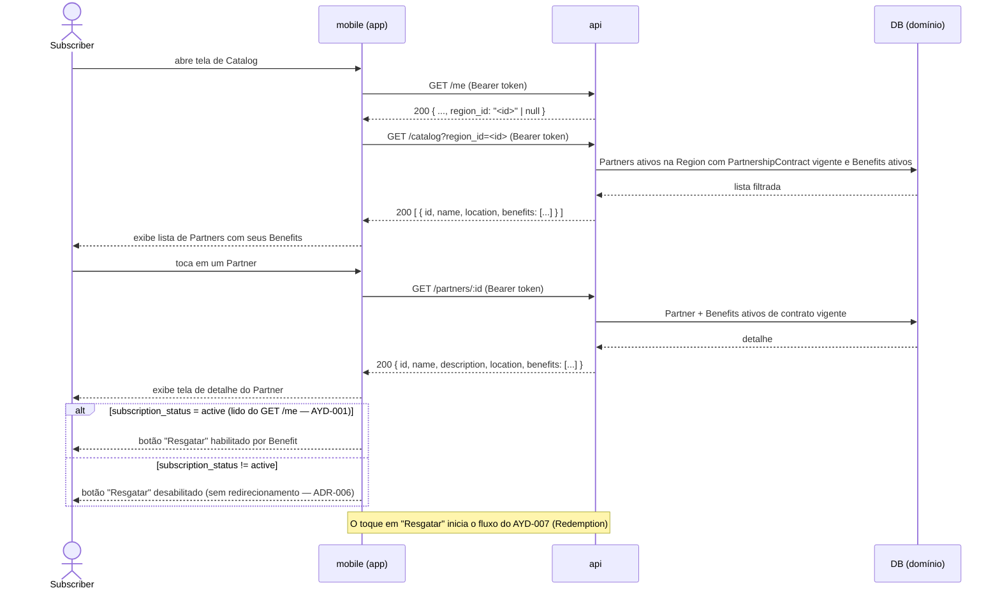

# AYD-005: Catalog — navegação da oferta pelo Subscriber

> Análise & Design cross-repo. Decide QUAIS repos a feature toca, o PAPEL de cada um
> e os CONTRATOS entre eles. Daqui nascem N SPECs (uma por repo afetado).

## Objetivo

Atende o **RF-05** (`Subscriber` visualiza o `Catalog` de `Benefit`s da sua `Region`) e o
**RF-06** (`Subscriber` vê detalhe de um `Partner` e seus `Benefit`s). Resultado esperado: um
`Subscriber` autenticado consegue **navegar** pelos `Partner`s ativos da sua `Region`, ver os
`Benefit`s disponíveis de cada um e acessar o detalhe de um `Partner` com suas condições de
desconto — tudo isso **independente de ter `Subscription` ativa** (REQ-001: `Catalog`
navegável sem assinatura).

**Escopo:** endpoints de leitura do `Catalog` (`GET /catalog`) e de detalhe de `Partner`
(`GET /partners/:id`) na `api`, mais as telas correspondentes no `mobile`. A feature
**consome** o modelo de domínio da oferta criado no AYD-004
(`Region`/`Partner`/`PartnershipContract`/`Benefit`) sem alterá-lo.

**O que não está aqui:** o `Redemption` (AYD-007) — o `Catalog` expõe a oferta; o resgate em
si é outra feature. O `mobile` **exibe** o botão de resgate, mas o gating e o registro do
evento ficam no AYD-007. RF-07 (busca/filtro por categoria) é *Should* e fica fora do MVP
(ver "Fora de escopo").

## Repos afetados e papéis

| Repo | Papel nesta feature | SPEC gerada |
|------|---------------------|-------------|
| api | Expõe `GET /catalog` (lista de `Partner`s com `Benefit`s, filtrada por `Region` e vigência do `PartnershipContract`) e `GET /partners/:id` (detalhe). Aplica RN-02 server-side. Estende o `GET /me` (AYD-001) com o campo `region_id`. Leitura pura — não altera o modelo de AYD-004. | SPEC-005@api |
| mobile | Exibe a tela de `Catalog` (lista de `Partner`s + `Benefit`s em destaque) e a tela de detalhe do `Partner`. Gatea o botão de resgate por `subscription_status` lido do `GET /me` (AYD-001). Não redireciona para a web de assinatura (ADR-006). | SPEC-005@mobile |

> `web` **não** é afetado: o `Catalog` e o `Redemption` ficam exclusivamente no `mobile`
> (REQ-001, "Fora"). A `web` do MVP existe apenas para o funil de assinatura (AYD-003,
> ADR-006).

## Contratos (fonte da verdade)

Toda chamada leva `Authorization: Bearer <Firebase ID token>` com `role: subscriber`
(ADR-002). O `Catalog` é acessível **independente** do `SubscriptionStatus` do `Subscriber` —
o gating por assinatura é **responsabilidade do `mobile`** (botão de resgate desabilitado),
não do endpoint de leitura.

```
GET /catalog
  auth: Bearer <Firebase ID token>   (role: subscriber)
  query:
    region_id: string   (obrigatório; MVP tem uma Region; no futuro derivado do perfil)
  res 200: [
    {
      id: string,
      name: string,
      description: string|null,
      location: { address?: string, lat?: number, lng?: number }|null,
      benefits: [
        {
          id: string,
          title: string,
          description: string|null,
          discount_type: "percentage" | "fixed_amount",
          discount_value: number
        }
      ]
    }
  ]
  filtros aplicados server-side (transparentes ao cliente):
    - partner.active = true  AND  partner.region_id = region_id
    - PartnershipContract vigente: starts_at <= now AND (ends_at IS NULL OR ends_at >= now)
    - benefit.active = true
    - Partners sem nenhum Benefit ativo no filtro acima são OMITIDOS da lista
  erros:
    401  token ausente/inválido/expirado
    422  region_id ausente

GET /partners/:id
  auth: Bearer <Firebase ID token>   (role: subscriber)
  res 200: {
    id: string,
    name: string,
    description: string|null,
    location: { address?: string, lat?: number, lng?: number }|null,
    benefits: [
      {
        id: string,
        title: string,
        description: string|null,
        discount_type: "percentage" | "fixed_amount",
        discount_value: number
      }
    ]
  }
  filtros: mesmos do /catalog — apenas Benefits ativos de PartnershipContracts vigentes
  erros:
    401  token ausente/inválido/expirado
    404  Partner inexistente, inativo ou sem PartnershipContract vigente

GET /me  (extensão adicionada por este AYD — campo novo na resposta existente de AYD-001)
  auth: Bearer <Firebase ID token>   (role: subscriber)
  campo adicionado à res 200:
    region_id: string | null
      — ID da Region ativa atribuída ao Subscriber.
      — MVP (única Region): a api resolve automaticamente para o ID da Region ativa;
        retorna null se nenhuma Region estiver ativa no sistema.
      — Futuro: quando o Subscriber puder selecionar a Region, este campo refletirá
        a escolha explícita (candidato a incremento de AYD-001).
```

**Notas de contrato:**
- **`savings_cap` não é exposto** — campo interno de anti-fraude (PDR-002), consumido
  exclusivamente pelo `Redemption` (AYD-007). Não faz parte da apresentação do `Catalog`.
- **`discount_value` é exposto** — o `mobile` usa para exibir "X% de desconto" ou
  "R$ X de desconto" ao `Subscriber`.
- **Vigência derivada do `PartnershipContract`** — o `status` (`active`/`scheduled`/`expired`)
  é calculado no instante da leitura (AYD-004); o `Catalog` retorna apenas o subconjunto
  onde `status = active` (RN-02).
- **Ordenação**: não especificada neste AYD — default do servidor (ex.: alfabético ou por
  cadastro). Ordenação por proximidade (`location`) e relevância são candidatos a ROAD "Later".
- **Paginação**: não incluída no MVP (escala piloto pequena); incluir se o volume de
  `Partner`s justificar (candidato a TDR@api).

## Modelo de domínio afetado

Nenhuma entidade nova é introduzida. O AYD-005 **consome** o modelo definido no AYD-004:

| Entidade | Uso neste AYD |
|----------|---------------|
| `Region` | Filtro primário do `Catalog` (via `region_id`) |
| `Partner` | Unidade de agrupamento da oferta; exibido na lista e no detalhe |
| `PartnershipContract` | Determina se o `Partner` aparece no `Catalog` (vigência — RN-02) |
| `Benefit` | Item de oferta exibido dentro de cada `Partner`; filtrado por `active` |

> Os campos `discount_type` e `discount_value` do `Benefit` (PDR-001) são expostos para
> exibição. O `savings_cap` (PDR-002) é retido na `api` e usado apenas no `Redemption`
> (AYD-007).

## Fluxo cross-repo



## Decisões relacionadas

- [AYD-004](AYD-004-admin-modelo-dominio-oferta.md) — pré-requisito: define o modelo de domínio
  (`Region`, `Partner`, `PartnershipContract`, `Benefit`) e os endpoints admin que criam a oferta
  que o `Catalog` expõe. Este AYD apenas lê; não redefine contratos de AYD-004.
- [ADR-001](../architecture_decisions/ADR-001-topologia-cross-repo.md) — a `api` é a fonte da
  verdade do domínio; o `mobile` consome via HTTP (Bearer token).
- [ADR-002](../architecture_decisions/ADR-002-autenticacao-autorizacao.md) — `role: subscriber`
  habilita os endpoints; `subscription_status` não gata a leitura do `Catalog` (gating é
  responsabilidade do `mobile` para o botão de resgate).
- [ADR-006](../architecture_decisions/ADR-006-conformidade-billing-lojas.md) — o `mobile` **não**
  redireciona para a web de assinatura ao exibir o botão desabilitado (sem steering nas lojas).
- [PDR-001](../product_decisions/PDR-001-savings-calculation.md) — `discount_type`/`discount_value`
  do `Benefit` são exibidos no `Catalog`; o cálculo efetivo do `Savings` ocorre só no `Redemption`.
- [PDR-002](../product_decisions/PDR-002-antifraude-redemption.md) — `savings_cap` é campo interno,
  não exposto no `Catalog`.
- Termos canônicos no [GLO](../_meta/glossary.md).

> Este AYD introduz uma **extensão ao contrato do `GET /me`** (AYD-001): adiciona o campo
> `region_id` à resposta existente. A extensão é documentada aqui porque é necessária para o
> fluxo do `Catalog` e não altera a decisão original de AYD-001. Novas decisões arquiteturais
> (protocolo, segurança cross-repo) → criam ADR; mudanças de contrato em AYD existentes →
> editam o AYD correspondente.

## Fora de escopo / questões em aberto

- **RF-07 — busca/filtro por categoria** (*Should*): fora do MVP. O campo `location` (AYD-004)
  já é base para proximidade futura, mas taxonomia/categoria de `Benefit` e endpoint de busca
  ficam para ROAD "Later". Incluir exigiria definir a estrutura de categorias (candidato a PDR).
- **Ordenação por proximidade**: `location` existe no `Partner` (AYD-004), mas o sort por
  distância não está no contrato — candidato a incremento posterior (TDR@api + UX no mobile).
- **Paginação do `Catalog`**: não incluída no MVP (piloto com volume pequeno de `Partner`s).
  Incluir se necessário (candidato a TDR@api).
- **`Subscriber.region_id` no perfil (seleção explícita)**: no MVP, a `Region` é resolvida
  automaticamente pelo `GET /me` (primeira `Region` ativa do sistema). Num futuro próximo, o
  `Subscriber` poderá selecionar explicitamente sua `Region` (via `PATCH /me` ou similar),
  e o campo `region_id` do `GET /me` refletirá essa escolha — revisitar após piloto
  (candidato a AYD ou incremento de AYD-001).
- **Resgate (`Redemption`)**: o botão de resgate é exibido neste AYD, mas o fluxo completo
  (leitura do QR TOTP, validação, registro durável + `Savings`) é do **AYD-007**.
- **`PartnerOperator` e QR rotativo**: exibição do QR no app do `Partner` é do **AYD-006**.
- **Métricas de navegação do `Catalog`** (cliques, visualizações): observabilidade de negócio
  a instrumentar conforme AYD-002; não é contrato deste AYD.
