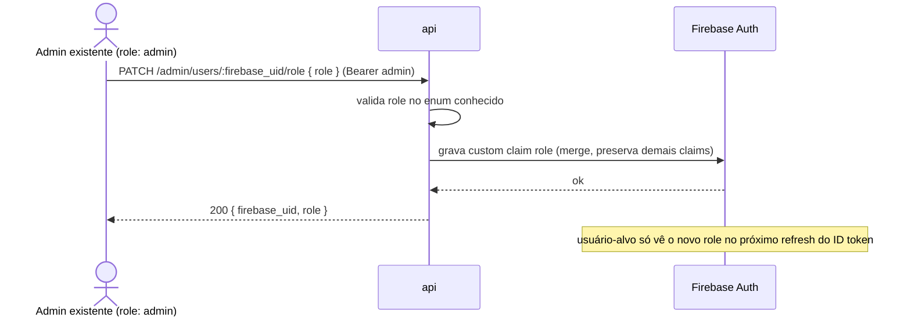

# AYD-008: Atribuição de role administrativa

> Análise & Design cross-repo. Decide QUAIS repos a feature toca, o PAPEL de cada um
> e os CONTRATOS entre eles. Daqui nascem N SPECs (uma por repo afetado).

> ### ⚠️ Estendido por [AYD-009](AYD-009-simplificacao-modelo-oferta-identidade.md) (17/08/2026)
> `PATCH /admin/users/:firebase_uid/role` passa a aceitar **`partner_id`** no body —
> obrigatório quando `role = partner_operator`, rejeitado nos demais roles. Este endpoint virou
> **o único caminho de provisionamento do `PartnerOperator`**, já que a tabela
> `partner_operators` foi removida. Rebaixar um operador limpa a claim `partner_id`.
> O restante deste documento continua válido.

## Objetivo

Fecha uma lacuna deixada em aberto pelo ADR-002: o `role` do usuário vive em custom claim no
token Firebase, mas nenhum contrato definia **como essa claim é atribuída** — os endpoints
internos de RF-13 (AYD-004) já assumem `role = admin` como pré-condição, sem nunca dizer quem
a grava. Sem isso, não existe caminho documentado para o **primeiro** admin existir, nem para
promover/rebaixar `Subscriber` ⇄ `PartnerOperator` ⇄ admin depois.

Resultado esperado: um endpoint interno (`role: admin`) que grava a claim `role` de um usuário
Firebase já existente. Não persiste nada no domínio — é escrita direta na claim (ADR-002), o
mesmo mecanismo já usado para `subscriber_id`/`operator_id` (TDR-001@api).

## Repos afetados e papéis

| Repo | Papel nesta feature | SPEC gerada |
|------|---------------------|-------------|
| api | Expõe o endpoint interno `role: admin` que grava a claim `role` no Firebase do usuário-alvo. | SPEC-008@api |

> `mobile`/`web` não são afetados — sem UI, mesma posição de RF-13/AYD-004.

## Contratos (fonte da verdade)

```
PATCH /admin/users/:firebase_uid/role      (admin)
  req:  { role: "subscriber" | "partner_operator" | "admin" }
  res 200: { firebase_uid, role }
  erros: 401 ; 403 (role != admin) ; 404 (firebase_uid inexistente no Firebase) ;
         422 (role fora do enum)
```

**Notas de contrato:**
- O usuário-alvo precisa **já existir no Firebase** (criado via app/console) — este contrato
  só atribui `role`, não cria conta.
- Sem efeito imediato na sessão já emitida: como em qualquer mudança de custom claim (ADR-002),
  o token do usuário-alvo só reflete o novo `role` no próximo refresh.
- **Bootstrap do primeiro admin:** continua sendo uma operação **fora da API**, feita
  diretamente no Firebase (console/Admin SDK) por quem tem acesso ao projeto — este endpoint
  serve promoções **seguintes**, feitas por um admin já existente. Ver "Fora de escopo".

## Modelo de domínio afetado

Nenhuma entidade nova. `role` já é termo do GLO/ADR-002 (`subscriber` \| `partner_operator` \|
`admin`); esta feature só define **quem e como** o grava depois do primeiro admin existir.

## Fluxo cross-repo



## Decisões relacionadas

- [ADR-002](../architecture_decisions/ADR-002-autenticacao-autorizacao.md) — define `role`
  como custom claim e já registrava, como consequência aceita, que "claim exige processo para
  propagar mudança de role"; este AYD é esse processo.
- [AYD-004](AYD-004-admin-modelo-dominio-oferta.md) — primeiro consumidor de `role = admin`
  nos endpoints internos; assumia a claim pronta, sem definir sua origem.
- Termos canônicos no [GLO](../_meta/glossary.md).

## Fora de escopo / questões em aberto

- **Bootstrap do primeiro admin:** deliberadamente fora deste contrato — seed inicial é
  operação manual fora da API (Firebase console/Admin SDK). Se isso virar dor operacional
  recorrente, é candidato a TDR@api (script local), não a mudança de contrato aqui.
- **Auditoria de quem promoveu quem:** não há trilha própria além do log padrão da
  observabilidade (AYD-002); se exigir histórico formal, vira candidato a AYD futuro.
- **Revogação de sessão ativa ao rebaixar role:** o token antigo continua válido até expirar
  ou o app forçar refresh — não há invalidação imediata no MVP.
