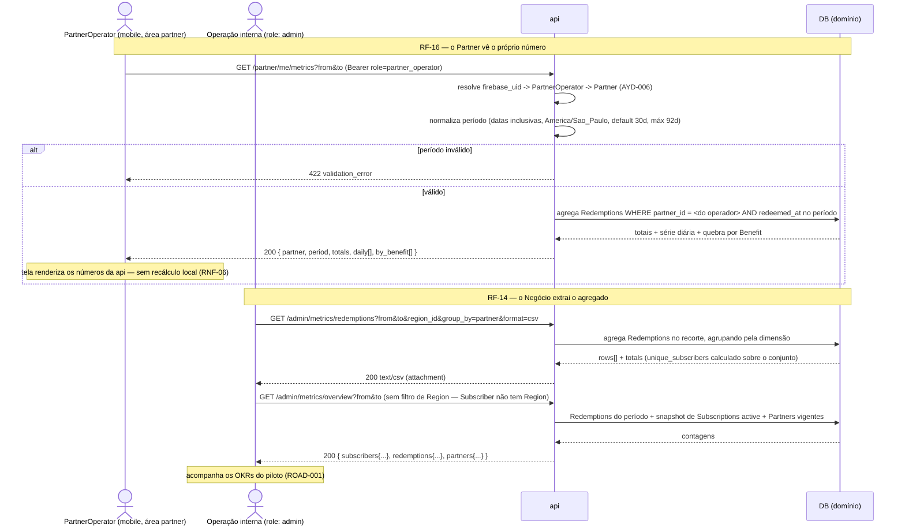

# AYD-009: Métricas de negócio — do próprio `Partner` no app + agregadas internas

> Análise & Design cross-repo. Decide QUAIS repos a feature toca, o PAPEL de cada um
> e os CONTRATOS entre eles. Daqui nascem N SPECs (uma por repo afetado).

## Objetivo

Atende **RF-16** (o `PartnerOperator` vê, no app, as métricas do **próprio `Partner`** —
`Redemption`s e `Savings` por período) e **RF-14** (o Negócio obtém métricas **agregadas**
por `Partner`/`Region`/período, por consulta/exportação **interna**, sem UI). Resultado
esperado: (a) o `Partner` abre o app e enxerga **quanto valor gerou** — quantos `Redemption`s
aconteceram no seu estabelecimento e quanto de `Savings` entregou aos `Subscriber`s no período
—, que é a **contrapartida comercial** da parceria (no MVP o `Partner` não paga: ele troca
desconto por engajamento, e este número é o que prova a troca); (b) a operação interna extrai,
via `api`, os números do piloto por `Partner`/`Region`/período, em JSON ou CSV.

Esta feature **não gera dado novo — ela lê**. O `Redemption` (AYD-007) já nasceu desenhado
para isto: `partner_id` e `region_id` **denormalizados**, `redeemed_at` como instante do uso e
o `savings` **congelado** (RN-03). Este AYD transforma esse fato acumulado em **leitura
agregada**, fechando o marco **M5 — "Piloto observável"** (ROAD) e o último requisito *Must*
do lado do `Partner` (RF-16) — o AYD-006 entregou auth + QR e adiou explicitamente as métricas
para cá.

**Escopo:** (1) o **endpoint de métricas do próprio `Partner`** (`role: partner_operator`,
escopado pela identidade); (2) os **endpoints internos de agregação e exportação**
(`role: admin`) por `Partner`/`Region`/`Benefit`/dia; (3) o **indicador de engajamento do
piloto** (quantos `Subscriber`s ativos de fato resgatam) que os OKRs do ROAD exigem; (4) a
**tela de métricas na área `partner`** do app mobile.

**Fora de escopo:** métricas **técnicas** de observabilidade (latência, erro, disponibilidade)
— são de outra natureza e já vivem em ADR-005/AYD-002 (ver "Nomenclatura" abaixo); qualquer
mutação de dado (este AYD é **read-only**); export **linha a linha** de `Redemption`s (LGPD —
ver questões em aberto); métricas de receita/`MRR` e **churn**, que dependem de definição de
produto ainda não tomada (candidatas a **PDR** — ver questões em aberto); painel web
(REQ-001: sem UI para admin, sem superfície web do `Partner`).

## Nomenclatura: métricas de **negócio** × métricas de **observabilidade**

O produto passa a ter duas coisas chamadas "métricas", e confundi-las produz contrato e código
ambíguos:

| | Métricas de **negócio** (este AYD) | Métricas de **observabilidade** (ADR-005/AYD-002) |
|---|---|---|
| O que é | Agregação de `Redemption`s e `Savings` — **fato de domínio** | Telemetria técnica (contadores, latência, RED por rota) |
| Fonte | Tabela de `Redemption` (fonte da verdade, auditável — RNF-06) | OpenTelemetry / Cloud Monitoring (amostrável, efêmero) |
| Termo canônico | **`RedemptionMetrics`** (GLO) | "telemetria"/`metrics.Inc` (facade — TDR-003@api) |
| Consumidor | `PartnerOperator` (app) e Negócio (interno) | Engenharia |

**Regra:** o contador de telemetria `redemption_created_total` (AYD-007) **não** é fonte de
número de negócio — ele é amostrável e não reconciliável. Todo número exibido ao `Partner` ou
exportado ao Negócio vem da **consulta ao `Redemption`** (RNF-06: "confiança no número"). O
termo `RedemptionMetrics` entra no [GLO](../_meta/glossary.md) por causa desta ambiguidade.

## Repos afetados e papéis

| Repo | Papel nesta feature | SPEC gerada |
|------|---------------------|-------------|
| api | **Dona do dado e da agregação** (ADR-001). Expõe a leitura agregada dos `Redemption`s em dois recortes de autorização: escopado ao **próprio `Partner`** (`role: partner_operator`, `Partner` derivado da identidade — nunca do payload, AYD-006) e **irrestrito** (`role: admin`) com filtros por `Region`/`Partner` e export CSV. Fixa a **janela de tempo** (dia de calendário em `America/Sao_Paulo`), a semântica de cada indicador e o que **não** é exposto (antifraude e PII). Não cria entidade nem coluna. | SPEC-009@api |
| mobile | **Cliente** (área `partner`, TDR-002@mobile — app único com áreas por `role`). Renderiza a tela de métricas do `Partner` autenticado: totais do período, série diária e quebra por `Benefit`, com seletor de período. **Consome** o contrato; não o redefine, não recalcula agregados localmente (o número exibido é o que a `api` devolveu — RNF-06). | SPEC-009@mobile |

> `web` **não** é afetado: não há superfície web do `Partner` nem painel admin (REQ-001;
> ADR-006 — a `web` é só funil de venda da `Subscription`).

## Contratos (fonte da verdade)

Todos os endpoints exigem `Authorization: Bearer <Firebase ID token>` (ADR-002) e são
**somente leitura** (`GET`; nenhum efeito colateral de domínio). Valores monetários
(`savings_total`, `purchase_amount_total`, `savings_avg`) trafegam em **reais** na borda JSON,
como em AYD-005/AYD-007.

**Janela de tempo (normativa, vale para todos os endpoints).** `from` e `to` são **datas**
(`YYYY-MM-DD`), **inclusivas nas duas pontas**, interpretadas como dias de calendário na
timezone da `Region` — **`America/Sao_Paulo`** no piloto, a mesma âncora do teto diário do
`Redemption` (AYD-007/RN-04). O período cobre de `from 00:00:00` a `to 23:59:59.999` local.
Ausentes → default **últimos 30 dias** terminando **hoje**. `to` no futuro é aceito e truncado
em hoje. Período vazio devolve **200 com zeros**, nunca 404.

### 1. Métricas do próprio `Partner` (RF-16 — app do `Partner`)

```
GET /partner/me/metrics                          (partner_operator)
  efeito: agrega os Redemptions do Partner do operador autenticado no período.
          O Partner é derivado da identidade (AYD-006) — NÃO existe parâmetro partner_id.
  query: ?from=YYYY-MM-DD&to=YYYY-MM-DD          // default: últimos 30 dias; range máx 92 dias
  res 200: {
    partner: { id, name },
    period: { from, to, timezone: "America/Sao_Paulo" },
    totals: {
      redemptions_count: number,       // Redemptions do Partner no período
      savings_total: number,           // R$ — soma dos Savings congelados (já tetados)
      unique_subscribers: number       // Subscribers DISTINTOS que resgataram (contagem, sem identidade)
    },
    daily: [                           // série do período, um item por DIA, incluindo dias zerados
      { date: "YYYY-MM-DD", redemptions_count: number, savings_total: number }
    ],
    by_benefit: [                      // desc por redemptions_count; só Benefits com uso no período
      { benefit: { id, title }, redemptions_count: number, savings_total: number }
    ]
  }
  erros: 401 ; 403 ; 422
```

| HTTP | `code` | Quando |
|------|--------|--------|
| 401 | `unauthenticated` | token ausente/inválido (ADR-002) |
| 403 | `forbidden` | token sem `role: partner_operator`, operador `active=false`, ou e-mail não pré-registrado (AYD-006) |
| 422 | `validation_error` | data malformada, `from > to`, ou range > 92 dias (`details: { field }`) |

### 2. Agregação interna por dimensão (RF-14 — consulta/export)

```
GET /admin/metrics/redemptions                   (admin)
  efeito: agrega os Redemptions do produto no período, filtrando e agrupando por dimensão.
  query:
    ?from=YYYY-MM-DD&to=YYYY-MM-DD               // default: últimos 30 dias; range máx 366 dias
    &region_id=<id>                              // filtro opcional
    &partner_id=<id>                             // filtro opcional
    &group_by=partner|region|benefit|day         // UMA dimensão; default "partner"
    &format=json|csv                             // default "json" (RF-14: exportação)
  res 200 (format=json): {
    period: { from, to, timezone: "America/Sao_Paulo" },
    filters: { region_id: string | null, partner_id: string | null },
    group_by: "partner",
    totals: {
      redemptions_count: number,
      savings_total: number,
      purchase_amount_total: number,   // soma dos purchase_amount AUTODECLARADOS (RN-05); null conta 0
      unique_subscribers: number
    },
    rows: [
      {
        dimension: { ... },            // shape depende de group_by (tabela abaixo)
        redemptions_count: number,
        savings_total: number,
        purchase_amount_total: number,
        unique_subscribers: number
      }
    ]
  }
  res 200 (format=csv): text/csv; UTF-8; cabeçalho na 1ª linha; ponto como separador decimal;
          colunas = campos de `dimension` achatados + as 4 métricas de `rows`.
          Content-Disposition: attachment; filename="redemption-metrics-<from>_<to>.csv"
  erros: 401 ; 403 ; 422
```

Shape de `dimension` por `group_by` (ordenação default entre parênteses):

| `group_by` | `dimension` | Ordem |
|------------|-------------|-------|
| `partner` | `{ partner: { id, name }, region: { id, name } }` | `savings_total` desc |
| `region` | `{ region: { id, name } }` | `savings_total` desc |
| `benefit` | `{ benefit: { id, title }, partner: { id, name } }` | `redemptions_count` desc |
| `day` | `{ date: "YYYY-MM-DD" }` | `date` asc, incluindo dias zerados |

| HTTP | `code` | Quando |
|------|--------|--------|
| 401 | `unauthenticated` | token ausente/inválido |
| 403 | `forbidden` | `role != admin` |
| 422 | `validation_error` | datas inválidas, range > 366 dias, `group_by`/`format` fora do enum, `region_id`/`partner_id` inexistente (`details: { field }`) |

### 3. Panorama do piloto (RF-14 — engajamento)

Os OKRs do ROAD ("`Redemption`s por `Subscriber` ativo/mês", "% de `Subscriber`s com ≥ 1
`Redemption`/mês", "`Savings` médio/`Subscriber`") não são deriváveis só do §2: eles cruzam
`Redemption` com a base de `Subscription`s **ativas**. Este endpoint entrega **apenas os
indicadores de definição inequívoca**; receita/`MRR` e **churn** ficam de fora por exigirem
decisão de produto (ver questões em aberto).

```
GET /admin/metrics/overview                      (admin)
  efeito: panorama de engajamento do período, para acompanhamento do piloto.
  query: ?from=YYYY-MM-DD&to=YYYY-MM-DD          // SEM filtro de Region — ver nota abaixo
  res 200: {
    period: { from, to, timezone: "America/Sao_Paulo" },
    subscribers: {
      active_count: number,            // SubscriptionStatus == active NO INSTANTE DA CONSULTA (snapshot)
      redeeming_count: number,         // Subscribers com >= 1 Redemption no período
      engagement_rate: number          // redeeming_count / active_count; 0 quando active_count == 0
    },
    redemptions: {
      count: number,
      per_active_subscriber: number,   // count / active_count; 0 quando active_count == 0
      savings_total: number,
      savings_avg_per_redeeming_subscriber: number   // savings_total / redeeming_count; 0 se 0
    },
    partners: {
      active_count: number,            // Partners ativos com PartnershipContract vigente hoje (RN-02)
      with_redemption_count: number    // Partners com >= 1 Redemption no período
    }
  }
  erros: 401 ; 403 ; 422
```

| HTTP | `code` | Quando |
|------|--------|--------|
| 401 | `unauthenticated` | token ausente/inválido |
| 403 | `forbidden` | `role != admin` |
| 422 | `validation_error` | datas malformadas, `from > to`, range > 366 dias (`details: { field }`) |

> **Por que este endpoint não aceita `region_id`.** O `Subscriber` **não tem `Region`** no
> modelo atual — `Subscriber.region_id` é um hook explicitamente adiado (AYD-005, "questões em
> aberto"); só `Partner` e `Redemption` carregam `region_id`. Um filtro de `Region` aqui
> recortaria o **numerador** (`redeeming_count`, via `Redemption`) sem recortar o
> **denominador** (`active_count`), devolvendo um `engagement_rate` silenciosamente errado —
> exatamente o oposto do RNF-06. Como o MVP opera **uma** praça (REQ-001), o filtro também não
> tem uso real hoje. Ele volta ao contrato quando `Subscriber.region_id` existir (multi-`Region`,
> RNF-08). Recorte por `Region` das métricas de **uso** continua disponível em §2, onde todos os
> números saem do `Redemption` e o filtro é coerente.

**Notas de contrato:**

- **Escopo por identidade, não por parâmetro (AYD-006).** O `GET /partner/me/metrics` **não
  aceita `partner_id`**: o `Partner` sai da identidade do `PartnerOperator`. É a mesma regra
  de `/partner/me` e `/partner/me/totp-secret` — não há caminho pelo qual um operador leia
  números de outro `Partner`. Ver `Partner` de terceiros é privilégio de `role: admin` (§2).
- **O `Partner` não vê `purchase_amount`.** `purchase_amount_total` aparece **só** nos
  contratos admin (§2). O valor é **autodeclarado pelo `Subscriber`** (RN-05, PDR-001) e não é
  a receita do `Partner`; exibi-lo ao `Partner` como "vendas geradas" seria afirmar um número
  que não apuramos e que ele pode contestar. Internamente ele vale como **métrica de ticket**,
  com a ressalva de ser autodeclarado. **Decisão deste AYD** — registrada em questões em aberto.
- **Antifraude continua sem vazar (AYD-005/AYD-007).** `savings_cap` e o flag
  `savings_capped` **não** aparecem em nenhuma resposta, admin inclusive; `savings_total` é a
  soma do `Savings` **reconhecido** (já tetado no uso). O teto segue auditável só na trilha
  interna (RNF-06).
- **Sem PII, em nenhum recorte (RNF-03/04).** Nenhum contrato aqui expõe identidade de
  `Subscriber` — nem `id` de domínio, nem e-mail, nem `firebase_uid`. `unique_subscribers` e
  `redeeming_count` são **contagens de distintos**, nunca listas. É o que permite entregar o
  número ao `Partner` (terceiro) sem transferir dado pessoal.
- **Números vêm do `Redemption`, não da telemetria.** Ver "Nomenclatura". Toda agregação é
  **recalculada na consulta** a partir da tabela de `Redemption` (imutável, append-only —
  AYD-007), o que torna qualquer número **reconciliável** com os eventos que o produziram
  (RNF-06). **Não há materialização/cache no MVP** — se o SLO apertar, materializar é
  **TDR@api**, não mudança de contrato.
- **`active_count` é um snapshot, não uma média do período.** `subscribers.active_count` e
  `partners.active_count` são contados **no instante da consulta** (não há histórico de
  `SubscriptionStatus` no modelo — AYD-003). Consequência: `engagement_rate` compara um
  período de uso contra uma base atual; é uma aproximação **aceita no piloto** e deve ser lida
  assim. Séries históricas fiéis exigiriam versionar o status → questão em aberto.
- **`unique_subscribers` não é somável entre linhas.** A contagem de distintos de duas linhas
  não soma para o total (o mesmo `Subscriber` pode aparecer em dois `Partner`s). Por isso
  `totals.unique_subscribers` é calculado **sobre o conjunto inteiro do recorte**, e não como
  soma de `rows[].unique_subscribers`. Vale para o CSV também.
- **Export é agregado, nunca linha a linha.** O CSV (§2) exporta **as linhas do `group_by`**,
  não os `Redemption`s individuais. Dump de eventos crus envolve dado pessoal e sai do
  "agregadas" do RF-14 — ver questões em aberto.
- **Dias zerados aparecem.** Em `daily` (§1) e em `group_by=day` (§2), dias sem `Redemption`
  vêm com zeros. É contrato porque o cliente desenha série temporal: buraco na série é bug de
  gráfico, não ausência de dado.
- **Performance.** Alvo: **p95 < 2s** para `/partner/me/metrics` (tela de app, mesmo alvo do
  `Catalog` — RNF-01). A agregação varre `Redemption` por (`partner_id`|`region_id`) ×
  `redeemed_at`; o AYD-007 só exigiu índice único de idempotência, então **índices de leitura
  para esta varredura são requisito desta feature** — a escolha concreta é da SPEC-009@api.
- **Observabilidade (AYD-002/ADR-005):** um contador por endpoint —
  `partner_metrics_viewed_total{region}` (§1), `admin_metrics_exported_total{group_by,format}`
  (§2) e `admin_metrics_overview_viewed_total` (§3, sem labels). Labels de baixa cardinalidade;
  **nunca** `partner_id`/`subscriber_id` como label.
- **Nenhuma mutação, nenhum efeito.** Todos os endpoints são `GET` idempotentes e sem escrita —
  inclusive o export.

## Modelo de domínio afetado

**Nenhuma entidade nova. Nenhuma coluna nova.** Esta é uma feature de **projeção de leitura**
sobre o `Redemption` (AYD-007), que já foi desenhado com as dimensões necessárias:

| Campo do `Redemption` (AYD-007) | Papel nas métricas |
|---------------------------------|--------------------|
| `partner_id` (denormalizado) | dimensão do RF-16 e do `group_by=partner` |
| `region_id` (denormalizado) | dimensão e filtro por `Region` no recorte admin do §2 (RNF-08) |
| `benefit_id` | dimensão do `by_benefit` / `group_by=benefit` |
| `subscriber_id` | base das **contagens de distintos** (nunca exposto) |
| `redeemed_at` | corte do período e da série diária |
| `savings` (congelado) | `savings_total` — o valor entregue, imutável (RN-03) |
| `purchase_amount` | `purchase_amount_total` (admin apenas; autodeclarado — RN-05) |

Um termo entra no GLO — **`RedemptionMetrics`** — para nomear a agregação e separá-la da
telemetria (ver "Nomenclatura"). Ele **não é entidade persistida**: é projeção derivada.

| Termo (GLO) | Papel nesta feature |
|-------------|---------------------|
| `RedemptionMetrics` | A projeção agregada servida por todos os contratos deste AYD. |
| `Redemption` | **Única fonte** dos números (imutável, auditável — RNF-06). |
| `Savings` | Somado no período; já tetado e congelado no uso (RN-03, PDR-002). |
| `Partner` | Recorte do RF-16 (escopado pela identidade) e dimensão do RF-14. |
| `Region` | Dimensão do RF-14 e filtro do panorama (RNF-08). |
| `Benefit` | Quebra que mostra ao `Partner` qual oferta traz gente. |
| `PartnerOperator` | Ator que consulta as métricas do próprio `Partner` (RF-16). |
| `Subscription` | Sua `SubscriptionStatus = active` define a base do engajamento (§3). |

## Fluxo cross-repo



## Decisões relacionadas

- [AYD-007](AYD-007-redemption-savings-historico.md) — **produz o dado** que este AYD lê, e já
  o desenhou para cá: `partner_id`/`region_id` denormalizados, `savings` congelado e
  `Redemption` append-only. Deixou métricas explicitamente para o AYD-009. A garantia de
  imutabilidade de lá é o que torna estes números reconciliáveis.
- [AYD-006](AYD-006-app-partner-auth-qr-totp.md) — estabelece a identidade do
  `PartnerOperator`, o `role: partner_operator` e a regra de **escopo por identidade** (`Partner`
  nunca vem do cliente) reaproveitada aqui; adiou o RF-16 para este AYD.
- [AYD-004](AYD-004-admin-modelo-dominio-oferta.md) — origem das dimensões
  (`Region`/`Partner`/`Benefit`) e do padrão de endpoints internos sob `/admin` com
  `role: admin`.
- [AYD-002](AYD-002-observabilidade-baseline.md) / [ADR-005](../architecture_decisions/ADR-005-observabilidade.md)
  — **fronteira**: telemetria técnica é lá; número de negócio é aqui, lido do `Redemption`.
  Este AYD emite contadores de uso, mas não os usa como fonte.
- [ADR-002](../architecture_decisions/ADR-002-autenticacao-autorizacao.md) — `role` em custom
  claim + **autorização por recurso**: o operador só lê o próprio `Partner`; `admin` lê tudo.
- [ADR-001](../architecture_decisions/ADR-001-topologia-cross-repo.md) — a `api` é a fonte da
  verdade; o app **exibe** o que ela agregou, não recalcula.
- [PDR-001](../product_decisions/PDR-001-savings-calculation.md) / [PDR-002](../product_decisions/PDR-002-antifraude-redemption.md)
  — definem o `Savings` somado aqui e o teto já aplicado no uso (que **não** é reexposto).
- Termos canônicos no [GLO](../_meta/glossary.md).

> **Nenhum contrato de fundação novo é introduzido:** o AYD é read-only sobre o modelo do
> AYD-007 e reusa a autorização do ADR-002/AYD-006. As escolhas que este AYD **fixa** por não
> estarem fechadas — não expor `purchase_amount` ao `Partner`, export só agregado, e o
> panorama de engajamento com base *snapshot* — estão registradas abaixo; endurecê-las ou
> revertê-las é PDR/ADR, não decisão local do serviço.

## Fora de escopo / questões em aberto

- **`MRR` e churn (PROD-001 North Star; OKRs do ROAD):** deliberadamente **fora**. Ambos
  exigem **definição de produto** antes de virar contrato — churn é taxa simples ou por
  coorte? conta `canceled` no pedido ou no fim do ciclo pago? `past_due` já é churn? `MRR`
  reconhece a `Subscription` `pending`? São decisões, não implementação → **candidatos a PDR**
  antes de um novo endpoint. O §3 entrega só o que é inequívoco hoje.
- **`purchase_amount` para o `Partner`:** fixado como **não exposto** (ver notas). Se o
  Negócio quiser dar ao `Partner` uma noção de "ticket movimentado", é decisão de produto
  (com a ressalva de ser autodeclarado) → revisita este AYD.
- **Export linha a linha de `Redemption`s:** fora do MVP. Um CSV de eventos crus carrega
  `subscriber_id` e padrões de consumo individuais — é tratamento de dado pessoal com base
  legal própria (RNF-04) e **não** é o "agregadas" do RF-14. Se a operação precisar, entra
  junto com a pendência LGPD do ROAD (item #10), não aqui.
- **Base histórica de `SubscriptionStatus`:** não existe (AYD-003 guarda o estado corrente).
  Por isso `active_count` é snapshot e `engagement_rate` é aproximação. Séries fiéis de base
  ativa exigem versionar o status (tabela de histórico) → candidato a AYD futuro, junto com
  `MRR`/churn.
- **Materialização/cache dos agregados:** não no MVP (recálculo por consulta, volume de uma
  praça). Se o p95 estourar, é **TDR@api** (view materializada, rollup diário, cache) — sem
  mudar contrato, porque a resposta é a mesma.
- **Múltiplas dimensões simultâneas** (`group_by=partner,day`): fora. Uma dimensão por
  consulta no MVP; cruzamentos o Negócio faz na planilha a partir do CSV. Revisitar se virar
  fricção real.
- **Métricas do `Partner` com granularidade menor que o dia** (hora do movimento, dia da
  semana): valiosas para o `Partner` operar, mas não são RF-16; candidatas ao "Later".
- **Comparação com período anterior** ("+18% vs. mês passado"): é UX desejável no app do
  `Partner`, mas o cliente consegue fazer com **duas chamadas**; um contrato de comparação
  embutido só se justificar-se no piloto.
- **Notificação/resumo periódico ao `Partner`** (ex.: push mensal "você entregou R$ X"):
  fora — depende de canal de notificação, que o produto ainda não tem.
- **`Region` como filtro do `/partner/me/metrics`:** desnecessário — um `Partner` pertence a
  exatamente uma `Region` (AYD-004).
- **`Region` como filtro do `/admin/metrics/overview`:** removido do contrato **por ora** (ver
  nota no §3): sem `Subscriber.region_id`, o filtro produziria `engagement_rate` errado. Entra
  junto com o hook de multi-`Region` adiado no AYD-005.
- **SPECs:** `SPEC-009@api` e `SPEC-009@mobile` nascem deste AYD (declaradas em `children`).
</content>
