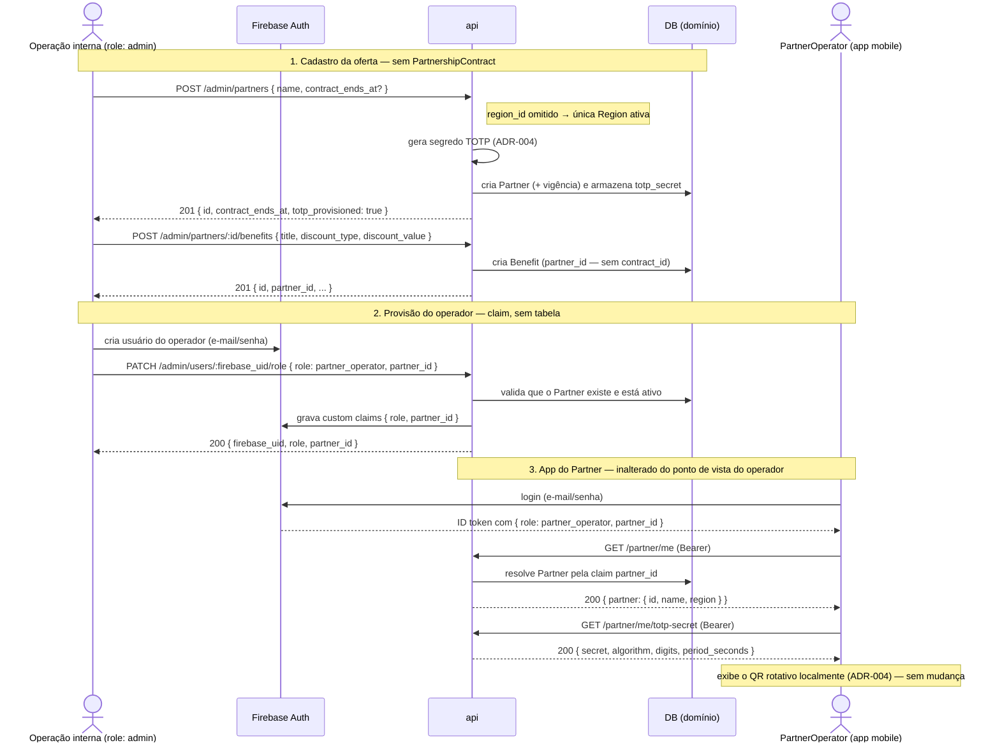

# AYD-009: Simplificação do modelo da oferta e da identidade do `PartnerOperator`

> Análise & Design cross-repo. Decide QUAIS repos a feature toca, o PAPEL de cada um
> e os CONTRATOS entre eles. Daqui nascem N SPECs (uma por repo afetado).

## Objetivo

Este AYD **não atende requisito novo**. Ele revisa *como* o RF-13 (administração interna) e o
RF-15 (auth do `PartnerOperator`) foram materializados em AYD-004/AYD-006, removendo três
estruturas que custam manutenção sem entregar comportamento observável no MVP.

Origem: análise de complexidade do produto (agosto/2026). O diagnóstico foi que o modelo foi
desenhado "corretamente" no papel **antes de existir uso** — entidades entraram por ortodoxia
de modelagem, não por necessidade demonstrada. As três abaixo foram confirmadas como
complexidade acidental:

| # | Estrutura | O que entrega hoje | Custo hoje (api) |
|---|-----------|--------------------|------------------|
| 1 | `PartnershipContract` como entidade | uma checagem de intervalo de datas (RN-02) | 1.180 LOC · 3 endpoints · join de 3 tabelas em `Catalog` e `Redemption` |
| 2 | `PartnerOperator` como entidade persistida | responder "de qual `Partner` é quem está logado?" | 2.005 LOC · 3 endpoints admin · tabela + bind de `firebase_uid` |
| 3 | CRUD de `Region` | gerir uma tabela de **uma linha** | 668 LOC · 2 endpoints |

O argumento decisivo do item 2: **o `Redemption` não grava `operator_id`** (AYD-007). Nenhuma
funcionalidade do MVP distingue um `PartnerOperator` de outro do mesmo `Partner` — o segredo
TOTP é por `Partner` (ADR-004) e as métricas do RF-16 são do `Partner`. A entidade persiste um
dado que nada consome.

**Resultado esperado:** mesmo comportamento observável para `Subscriber`, `PartnerOperator` e
operação interna, com ~3.850 LOC e 8 endpoints a menos.

### O que este AYD explicitamente **não** muda

- **QR rotativo TOTP (ADR-004) permanece.** Foi avaliada a alternativa de QR estático e
  **descartada pelo owner**: a rotação é segurança que se paga, e o app do `Partner` na mão do
  balcão — com as métricas do próprio `Partner` (RF-16) — tem valor de produto próprio.
- **O app do `Partner` permanece integralmente** (RF-15/16/17). Muda apenas o que existe
  *atrás* da identidade dele: claim em vez de tabela.
- **`Region` continua dimensão de primeira classe (RNF-08).** `region_id` segue coluna em
  `partners` e `redemptions`. Some o CRUD de uma tabela de uma linha, não a dimensão.

## Repos afetados e papéis

| Repo | Papel nesta feature | SPEC gerada |
|------|---------------------|-------------|
| api | **Dono do modelo de domínio** (ADR-001). Colapsa `PartnershipContract` em `Partner`; troca a claim `operator_id` por `partner_id` e remove a tabela `partner_operators`; remove o CRUD de `Region` mantendo a tabela e as FKs; migra os dados existentes. | SPEC-009@api |
| mobile | **Consome** `GET /partner/me`, cujo envelope perde o bloco `operator`. Ajuste de tipo e de tela na área `partner`; o fluxo de QR/TOTP não muda. | SPEC-009@mobile |

> `web` **não** é afetado: não toca `Partner`/`Benefit`/`Region` nem o app do `Partner`.

## Contratos (fonte da verdade)

Estes contratos **substituem** os equivalentes em AYD-004 §Contratos, AYD-006 §Contratos e
AYD-008 §Contratos. Onde um endpoint não aparece aqui, o contrato anterior segue valendo.

### A. `PartnershipContract` colapsa em `Partner`

**Removidos** (sem substituto — a vigência passa a ser campo do `Partner`):

```
POST  /admin/partners/:id/contracts        ✗ removido
GET   /admin/partners/:id/contracts        ✗ removido
PATCH /admin/contracts/:id                 ✗ removido
```

**`Benefit` passa a pendurar direto no `Partner`:**

```
POST  /admin/partners/:id/benefits         (admin)   — era POST /admin/contracts/:id/benefits
  req:  {
    title: string,
    description?: string,
    discount_type: "percentage" | "fixed_amount",
    discount_value: number,
    savings_cap?: number,
    active?: boolean
  }
  res 201: { id, partner_id, title, description, discount_type, discount_value,
             savings_cap, active, created_at }
  erros: 401 ; 403 ; 404 (partner) ; 422 (discount_type/value inválidos)

GET   /admin/partners/:id/benefits         (admin)   — era GET /admin/contracts/:id/benefits
  res 200: [ { ...benefit } ]

PATCH /admin/benefits/:id                  (admin)   — path e body inalterados
  req:  { title?, description?, discount_type?, discount_value?, savings_cap?, active? }
  res 200: { ...benefit }
```

> O campo `contract_id` do `Benefit` vira **`partner_id`** em toda resposta.

**`Partner` absorve a vigência:**

```
POST  /admin/partners                      (admin)
  req:  {
    region_id?: string,                    // AGORA OPCIONAL — ver §C
    name: string,
    description?: string,
    location?: { address?: string, lat?: number, lng?: number },
    contract_starts_at?: string,           // ISO-8601; null/ausente = vigente desde já
    contract_ends_at?: string              // ISO-8601; null/ausente = vigência aberta
  }
  res 201: { id, region_id, name, description, location,
             contract_starts_at, contract_ends_at,
             totp_provisioned: true, active: true, created_at }
  erros: 401 ; 403 ; 404 (region_id informado e inexistente) ;
         422 (payload inválido; contract_ends_at < contract_starts_at)

GET   /admin/partners/:id                  (admin)
  res 200: { ...Partner sem segredo }      // ✗ o array `contracts: [...]` deixa de existir

PATCH /admin/partners/:id                  (admin)
  req:  { name?, description?, location?, active?,
          contract_starts_at?, contract_ends_at? }   // não altera region_id nem segredo
  res 200: { ...Partner }
  erros: 401 ; 403 ; 404 ; 422 (contract_ends_at < contract_starts_at)
```

**RN-02 passa a ser lida assim** (mesma semântica, uma tabela a menos no join):

```sql
partners.active = true
AND benefits.active = true
AND (partners.contract_starts_at IS NULL OR partners.contract_starts_at <= now)
AND (partners.contract_ends_at   IS NULL OR partners.contract_ends_at   >= now)
```

> Encerrar uma parceria antecipadamente = `PATCH /admin/partners/:id { contract_ends_at }`.
> O documento comercial assinado **não é dado de aplicação** e não mora na `api`.

### B. `PartnerOperator` deixa de ser entidade persistida

**Removidos** (a provisão do operador passa a ser atribuição de claim):

```
POST  /admin/partners/:id/operators        ✗ removido
GET   /admin/partners/:id/operators        ✗ removido
PATCH /admin/operators/:id                 ✗ removido
```

**A atribuição de role (AYD-008) ganha o vínculo com o `Partner`:**

```
PATCH /admin/users/:firebase_uid/role      (admin)
  req:  {
    role: "subscriber" | "partner_operator" | "admin",
    partner_id?: string          // OBRIGATÓRIO quando role = partner_operator;
                                 // REJEITADO nos demais roles
  }
  res 200: { firebase_uid, role, partner_id? }
  erros: 401 ; 403 ; 404 (partner_id inexistente ou inativo) ;
         422 (role inválido ; partner_id ausente em partner_operator ;
              partner_id informado em subscriber/admin)
```

> Efeito: grava as custom claims `role` e `partner_id` no usuário Firebase. **Rebaixar** um
> `partner_operator` para outro role **limpa** a claim `partner_id` na mesma operação.

**Claims (ADR-002):** `operator_id` ✗ → **`partner_id`**. O `Partner` passa a ser resolvido
direto da claim, sem lookup de operador.

**`GET /partner/me` perde o bloco `operator`** — este é o ponto que atinge o `mobile`:

```
GET /partner/me                            (role: partner_operator)

  res 200 ANTES:
    { operator: { id, name, email },
      partner:  { id, name, region: { id, name } } }

  res 200 DEPOIS:
    { partner:  { id, name, region: { id, name } } }

  erros: 401 ; 403 (role != partner_operator) ;
         404 (claim partner_id ausente, ou Partner inexistente/inativo)
```

```
GET /partner/me/totp-secret                (role: partner_operator)   — INALTERADO
  res 200: { partner_id, secret, algorithm, digits, period_seconds, issued_at }
```

> A identidade da *pessoa* operadora continua existindo — ela é o **usuário Firebase**
> (e-mail, nome, recuperação de senha, desativação). O que deixa de existir é a **cópia local**
> desse usuário numa tabela nossa. Desativar um operador = desativar/remover o usuário no
> Firebase Console, não um `PATCH` na nossa api.

### C. `Region` perde o CRUD, mantém a dimensão

**Removidos:**

```
POST /admin/regions                        ✗ removido
GET  /admin/regions                        ✗ removido
```

**Mantidos:** a tabela `regions` e as FKs `partners.region_id` e `redemptions.region_id`.
A `Region` piloto é **semeada por migration** com id determinístico.

**Resolução implícita:** `region_id` vira opcional em `POST /admin/partners`; quando omitido,
resolve para a **única `Region` ativa** — exatamente a regra que o `Catalog` já aplica hoje
(`FindActiveRegion`). Se houver zero ou mais de uma `Region` ativa, a criação falha com `422`,
sinalizando que a operação virou multi-`Region` e precisa de um AYD próprio.

## Modelo de domínio afetado

Nenhum termo **novo**. Dois termos do GLO mudam de natureza (entidade → atributo/identidade) e
são atualizados no glossário na mesma edição.

**`Partner`** — absorve a vigência:

| Campo | Tipo | Mudança |
|-------|------|---------|
| `contract_starts_at` | timestamp\|null | **novo** — início da vigência (RN-02); null = desde sempre |
| `contract_ends_at` | timestamp\|null | **novo** — fim da vigência (RN-02); null = aberta |
| demais campos | — | inalterados (`region_id`, `name`, `description`, `location`, `totp_secret`, `active`) |

**`Benefit`** — reparenteado:

| Campo | Tipo | Mudança |
|-------|------|---------|
| `contract_id` | id (FK) | ✗ **removido** |
| `partner_id` | id (FK) | **novo** — substitui `contract_id`; aponta o `Partner` que oferta |

**`PartnershipContract`** — ✗ **deixa de ser entidade.** A tabela `partnership_contracts` é
removida. O conceito comercial permanece no GLO, representado pelos dois campos de vigência do
`Partner`.

**`PartnerOperator`** — ✗ **deixa de ser entidade persistida.** A tabela `partner_operators` é
removida. O ator permanece no GLO: é o usuário Firebase com `role = partner_operator` e claim
`partner_id`.

**`Region`** — inalterada como entidade e como FK. Só o CRUD sai.

**`Redemption`** — **inalterado**. Continua gravando `subscriber_id`, `benefit_id`,
`partner_id`, `region_id`, `savings` etc. Nenhuma coluna some — o histórico já existente segue
íntegro e atribuível (RNF-06).

### Migração de dados (api)

Ordem normativa, tudo em uma migration reversível:

1. `ALTER TABLE benefits ADD COLUMN partner_id`.
2. `UPDATE benefits SET partner_id = (SELECT partner_id FROM partnership_contracts WHERE id = benefits.contract_id)`.
3. `ALTER TABLE partners ADD COLUMN contract_starts_at, contract_ends_at`.
4. Para cada `Partner`, copiar a vigência do **contrato mais abrangente** (menor `starts_at`;
   `ends_at` = `NULL` se qualquer contrato for aberto, senão o maior `ends_at`).
5. `benefits.partner_id NOT NULL` + FK; `DROP COLUMN benefits.contract_id`;
   `DROP TABLE partnership_contracts`.
6. `DROP TABLE partner_operators` — precedido de **backfill das claims**: para cada operador
   com `firebase_uid` não nulo, gravar `partner_id` no usuário Firebase correspondente.

> O passo 6 toca um sistema externo (Firebase) e **não é reversível por migration**. Roda como
> script idempotente **antes** do deploy que remove a tabela.

## Fluxo cross-repo



## Decisões relacionadas

- [AYD-004](AYD-004-admin-modelo-dominio-oferta.md) — **revisado por este AYD**: os contratos de
  `PartnershipContract` e de CRUD de `Region` daquele documento não valem mais; o modelo de
  `Partner`/`Benefit` passa a ser o desta seção.
- [AYD-006](AYD-006-app-partner-auth-qr-totp.md) — **revisado por este AYD** na parte de
  provisionamento e identidade do `PartnerOperator`. A parte de **QR/TOTP permanece integralmente
  válida**.
- [AYD-008](AYD-008-atribuicao-role-admin.md) — **estendido**: `PATCH /admin/users/:firebase_uid/role`
  passa a aceitar `partner_id`.
- [ADR-002](../architecture_decisions/ADR-002-autenticacao-autorizacao.md) — a identidade de
  domínio já trafega como custom claim (`subscriber_id`); `partner_id` segue o mesmo padrão já
  estabelecido. **Nenhuma decisão de arquitetura nova é necessária.**
- [ADR-004](../architecture_decisions/ADR-004-resolucao-redemption-qr-totp.md) — **mantido sem
  alteração**. O segredo TOTP sempre foi por `Partner`; remover a entidade `PartnerOperator`
  alinha a implementação ao que o ADR já dizia.
- Termos canônicos no [GLO](../_meta/glossary.md) — `PartnershipContract` e `PartnerOperator`
  atualizados (entidade → atributo/identidade) na mesma edição.

> Nenhum contrato **novo** nasce aqui: este AYD só **remove** estrutura e **reparenteia** o que
> ficou. Por isso não gera ADR.

## Fora de escopo / questões em aberto

- **TOTP e app do `Partner`:** mantidos por decisão do owner (ver §Objetivo). A alternativa de
  QR estático foi avaliada e descartada — não revisitar sem dado do piloto.
- **RF-16 (métricas do próprio `Partner`):** continua no AYD de métricas (**AYD-010**). Ele lê
  `redemptions` por `partner_id` — não dependia de `PartnerOperator` nem de
  `PartnershipContract`, então não é afetado.
- **Auditoria por operador:** com a tabela removida, não há como atribuir um `Redemption` a uma
  *pessoa* do `Partner`. Isso **já era verdade** hoje (o `Redemption` nunca gravou `operator_id`).
  Se o piloto pedir essa granularidade, é AYD novo — e aí a claim `partner_id` conviveria com um
  `operator_id` gravado no `Redemption`.
- **Histórico comercial dos contratos** (versões, reajustes, quem assinou): sai do escopo da
  aplicação. Mora no processo comercial, fora da `api`.
- **Multi-`Region`** (RNF-08): a resolução implícita da §C falha explicitamente com `422` se
  houver mais de uma `Region` ativa. Reintroduzir o CRUD é trivial e será parte do AYD de
  expansão geográfica, quando houver.
- **`savings_cap` por `Benefit`:** também apontado na análise como candidato a virar constante
  global. **Não entra neste AYD** — é decisão de produto (PDR-002) e merece PDR próprio.
